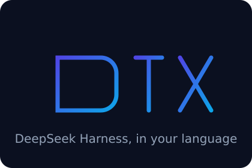
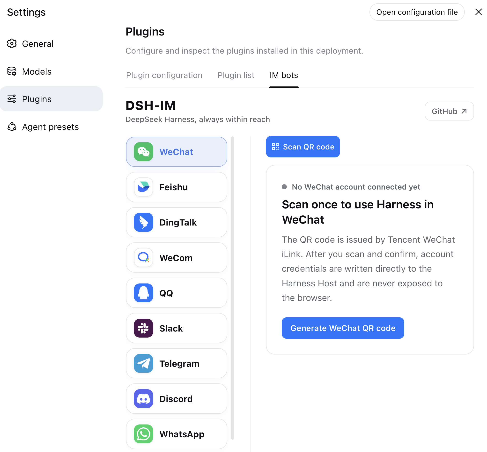

<p align="center">
  
</p>

---

<div align="center">
  <p><strong>DeepSeek Harness, in your language</strong></p>

  <p>
    <a href="LICENSE"></a>
    
    = 22.19">
    
  </p>

  <p>
    
    
    
    
    
    
    
    
    
  </p>

  <p><strong>English</strong> · <a href="README.zh-CN.md">简体中文</a></p>
</div>

---

## Introduction

Connect IM bots to DeepSeek Harness by scanning a QR code, using an App Manifest, or entering existing bot credentials, and let the local Harness connect outward to a public AI Office.
One plugin and one settings entry manage nine multi-bot IM channels and the AI Office Connector.

`dsh-im-x` is an English-first fork of [dsh-im](https://github.com/xmanrui/dsh-im) by [xmanrui](https://github.com/xmanrui).
It keeps every channel and feature of the original and replaces its hardcoded Chinese copy with a real translation layer, so the same bot can talk to an English team and a Chinese team from one install.
See [Credits](#credits) and [What this fork changes](#what-this-fork-changes).

## Language support

Every user-facing string comes from a message catalogue rather than being written into channel code.
English is the default and the source of truth; Simplified Chinese ships alongside it with full coverage.

A conversation's language is resolved in this order:

1. `/lang <code>` in the chat. The most specific and most recent thing the user asked for, so it wins. `/lang` on its own reports the current language and lists what is available; `/lang auto` clears the override.
2. The bot's configured locale. An operator who pinned a language did so deliberately, so a visiting user's phone setting does not silently override it.
3. The locale the channel reports for the sender, used only when the bot is left on `auto`. Telegram, Slack, and Discord all report one, in three different formats, and each is negotiated down to a catalogue the build actually ships.

Some behaviour follows from this rather than being separate features:

- Approval replies are accepted in every supported language, so `approve`, `deny`, `批准`, and `拒绝` all work no matter which language the prompt was rendered in.
- Telegram's command menu is registered once per language through `setMyCommands`, so each user sees the menu in their own client language.
- Relative timestamps in `/sessionlist` are formatted with `Intl` for the active locale instead of a fixed date pattern.
- The prompt sent for an image with no caption, and the AI Office handoff prompt, are both translated, so the agent is not asked a question in a language the user does not read.

The settings page follows the language the Harness client is set to, and takes only that from the host: lookup, fallbacks, and placeholders come from the same catalogue the channel runtimes use.

### Adding a language

Add a locale module under `src/i18n/locales/`, register it in `src/i18n/index.mjs`, and give it a display name.
A parity test then requires the new catalogue to cover every English key and to use the same placeholders, so a partial translation fails the build rather than reaching a user as a mix of two languages.
Channel code never contains a sentence, so a new language needs no changes outside `src/i18n/`.

## Interface



_Screenshot from upstream; the settings page renders in the language the Harness client is set to._

## Built-in channels

| Channel | Setup | Messaging and replies |
| --- | --- | --- |
| Feishu | Create a bot by QR code, or bind one with App ID + App Secret | Persistent connection for incoming messages; streaming cards show thinking, tool progress, and replies |
| WeChat | Scan a QR code to bind a WeChat bot | Tencent iLink long polling for sending and receiving messages |
| DingTalk | Create a bot by QR code, or bind one with Client ID + Client Secret | DingTalk Stream connection; streaming replies through AI Cards |
| WeCom | Create an intelligent bot by QR code, or bind one with Bot ID + Secret | Official WebSocket connection; native thinking state, tool progress, and streaming replies |
| QQ | Create a bot with mobile QQ QR scanning, or bind one with AppID + AppSecret | WebSocket connection; native typing and streaming replies in private chats, replies when mentioned in groups |
| Slack | Create an app from the bundled App Manifest, then enter a Bot Token (`xoxb-`) and App Token (`xapp-`) | Socket Mode connection; direct DM replies, mention-only channel replies, and preferred native streaming API |
| Telegram | Enter a Bot Token generated by @BotFather | Bot API long polling; DMs work by default and groups respond to mentions or replies, while each bot can optionally enable a private-DM allowlist; streaming uses message edits |
| Discord | Enter a Bot Token generated in the Developer Portal | Gateway v10 connection; direct DM replies, mention-only server replies, and streaming through message edits |
| WhatsApp | Scan a QR code with mobile WhatsApp to link a device | WhatsApp Web connection; read receipt and typing indicator followed by the final answer |

Other IM platforms can be added through the same channel-adapter structure.

All nine built-in channels can send JPEG, PNG, and WebP images, plus GIFs sent as image files, with optional captions to Harness. Each image is limited to 5 MB, and images in one message are limited to 20 MB in total.

### Result-file delivery

All nine built-in channels can return any file readable by Harness as a native channel attachment. Existing files and files created by the current task can both be sent directly. The capability is available to every connected bot by default, with no switch or per-bot allowlist, while existing text, image, streaming, command, and Session behavior remains unchanged.

After the model calls the file-return tool, the plugin hands the specified file to the channel's native attachment API. The plugin adds no rules for file origin, creation time, workspace boundary, extension, content, count, size, or lifetime; the file only needs to exist and be readable. A channel may still reject delivery according to its own permissions, quota, file capability, or account tier, and the plugin reports that provider result.

| Channel | Platform requirements |
| --- | --- |
| WeChat | The current binding protocol and conversation must support native file messages; the WeChat API response determines the actual range. |
| Feishu | Feishu's file-upload API requires a non-empty file no larger than the platform's 30 MB limit. The app needs the `im:resource` tenant scope (**Read and upload images or other files**). Apps created through the built-in QR flow request it by default; existing or manually connected apps still need it added and approved. The Feishu developer console currently has no separate `im:resource:upload` scope. |
| DingTalk | The app needs `qyapi_base`, and the bot must support file messages. The current OAPI and bot capability determine the accepted formats and sizes. |
| WeCom | The app needs media-upload and file-message capability; the WeCom API response determines the actual range. |
| QQ | The bot needs file-message capability and remains subject to QQ's daily upload quota; the bot reports when the quota is exhausted. |
| Slack | The Bot Token needs `files:write`; the Workspace's current policy determines the actual size limit. After changing scopes, re-authorize/reinstall the App and reconnect the bot. |
| Telegram | The bot must be allowed to send documents in the current chat; the Bot API response determines the actual range. |
| Discord | The bot needs **Send Messages**, **Attach Files**, and **Read Message History**. The current account and server capability determine the actual attachment allowance. |
| WhatsApp | The linked session must support Document Messages; the WhatsApp/Baileys response determines the actual range. |

## AI Office Connector

The **AI Office** page lets the local Harness connect outward to a public Office. The machine needs no public IP, forwarded port, or WebSocket server. The Device Token is written only to the Harness credential provider; the ordinary config file contains only the device ID, Office origin, workspace aliases, and instruction-preset aliases. Office selects aliases and never receives local absolute paths.

The current protocol is `office-harness.v1`. The connector authenticates and advertises capabilities with `POST /api/harness/connector/heartbeat`, then opens the downstream event plane with `GET /api/harness/connector/stream` over SSE. The settings page derives every fixed hook from the Office Base URL and reconnects with backoff after a disconnect.

A `job.available` event makes the local connector fetch the payload, validate Workspace/Preset aliases, claim a 90-second lease, and renew it every 30 seconds. It creates an isolated Harness Session, reports safe status/tool/text progress, and writes a terminal result exactly once. Tool approvals and follow-up questions surface in Office; approve, reject, and text answers return over SSE to the original Session. Heartbeats and leases recover from dropped connections.

A successful heartbeat response must be JSON: `{"ok":true,"protocolVersion":"office-harness.v1"}`. This makes a successful connection test proof of a compatible Office Connector instead of any URL that happens to return 200.

## Installation

Install the published stable release from npm (recommended):

```sh
dsh plugin --profile web add -w dsh-im-x
```

Restart `dsh web`, then open **Settings → Plugins → IM Bot**.

To try the latest code before it is published to npm, install from the GitHub source instead:

```sh
npx -y github:zaakirio/dsh-im-x install
```

A GitHub-source installation fetches and builds a Git dependency directly. With pnpm 10 or newer, the profile may first need an `allowBuilds` entry in `pnpm-workspace.yaml`. Most users should prefer the stable npm release.

After installation, follow the built-in instructions on each channel page to scan a QR code or enter credentials. Secrets and Tokens are sent only to the local Harness Host and stored through its protected credential provider; status responses and bot lists never return them.

If this machine must use a forward proxy to reach Feishu, set `HTTPS_PROXY` to a full HTTP proxy URL before starting `dsh web` (for example, `http://proxy:8080`; lowercase `https_proxy` is also supported, with `HTTP_PROXY` accepted as a fallback), then restart the Host after changing it. Feishu registration and credential verification reuse the SDK's proxy-aware HTTP client, while the message WebSocket explicitly uses that proxy; the WebSocket path does not currently read `ALL_PROXY` or `NO_PROXY`.

| Default behavior | Description |
| --- | --- |
| Bot workspace | Each bot stores its workspace independently. New bots start with the Host's current working directory, which can later be changed from the bot card. |
| Agent Preset | Each bot can choose an Agent Preset on its settings card. When none is chosen, new Sessions follow the Host's `agent-presets.default`. A channel-level `config.agentPreset` is only the default for later new bots on that channel. Changing the preset never modifies or clears existing Sessions; if the current chat already has a Session, send `/new` and then a regular message to create one with the new selection. |

Each Telegram bot has its own access-mode control on its bot card. Existing and newly connected bots both default to **Compatible mode**: DMs receive replies, while group messages require a mention of or reply to the bot. Restrictions apply only after explicitly switching that bot to **Safe mode (private-chat allowlist)**. Safe mode ignores every group message and admits only numeric User IDs in that bot's allowlist. Enter one ID per line. Switching back to Compatible mode retains the allowlist without enforcing it, so it is available when Safe mode is enabled again. An empty allowlist in Safe mode rejects all inbound messages for that bot.

## Bot commands

| Command | Description |
| --- | --- |
| `/help` | Show the commands and usage supported by the bot. |
| `/new` | Unbind the current chat so its next ordinary message starts a new Harness Session. |
| `/status` | Check the connection between the current bot and DeepSeek Harness. |
| `/models` | List every currently configured model with a number. |
| `/model` | Show the model used by the Session bound to this chat. |
| `/model <number or provider/model-id>` | Switch the model for the Session bound to this chat. |
| `/presetlist` | List the Host's currently available Agent Presets, marking the Host default and this bot's selection. |
| `/preset` | Show this bot's Agent Preset setting for new Sessions. |
| `/preset <number or Preset ID>` | Set this bot's Agent Preset; use `/preset id:<ID>` for a numeric ID. |
| `/preset --default` | Clear this bot's explicit selection so later new Sessions follow the Host default. |
| `/stop` | Immediately stop this chat's running task while preserving work that has not started. |
| `/steer <additional instruction>` | Inject an additional instruction into this chat's running task. |
| `/compact` | Immediately compact older context in the Session bound to the current chat. |
| `/workspace <absolute workspace path>` | Switch the current bot's Harness workspace. |
| `/workspacelist` | List workspace absolute paths that still exist on the current Harness Host. |
| `/sessionlist [workspace number or absolute path]` | List every registered session ID and title in the selected workspace; omit the argument to use the current workspace. |
| `/session <Session ID>` | Bind the current chat to an existing Harness session. |
| Interactive question | Reply with an option number, option label, or custom text; separate multiple choices with commas. |
| `/lang` | Show the language of this chat and the languages available. |
| `/lang <code>` | Switch this chat to that language; `/lang auto` clears the override. |
| Remote approval | Reply with `approve` / `deny` / `yes` / `no`. Chinese decision words (`批准` / `拒绝` / `同意` / `不同意`) are accepted too, in any language. |

Example: send `/models`, then `/model 2` to switch to the second model in the list; send `/presetlist`, then `/preset 2` to select the second Agent Preset for this bot. Other examples: `/help`, `/new`, `/status`, `/model deepseek-official/deepseek-v4-pro`, `/preset marketing-jeep`, `/preset --default`, `/steer inspect only the configuration file`, `/stop`, `/compact`, `/workspace /Users/alice/projects/my-app`, `/sessionlist 2`, `/sessionlist /Users/alice/projects/my-app`, or `/session session-id`

If the Slack desktop app has no native Slash Command registered with the same name, it intercepts messages that begin directly with `/`. Send the command with one leading space instead, for example ` /presetlist` or ` /preset 2`; the plugin command layer trims surrounding whitespace, so it executes exactly like the unspaced form.

### Command details

- `/help` takes no arguments and never creates a Session. It returns the complete command list supported by the current bot, in that chat's language.
- `/lang` takes no arguments and reports the chat's current language plus the languages this build ships. `/lang <code>` pins one for this chat only and confirms in the language just selected; `/lang auto` clears the override so the bot setting and the channel-reported locale apply again. It never creates a Session or prompts the model.
- `/status` takes no arguments, never prompts the model, and does not change the Session binding. It confirms that the current bot can reach DeepSeek Harness.
- `/new` only removes the current chat's saved Session binding; it never deletes, empties, or archives the old Session. The next ordinary message creates and binds a new Session in the current workspace. If a task is running or waiting for a question or approval, finish the interaction or use `/stop` before `/new`.
- `/models` takes no arguments and never creates a Session. It assigns a number to every currently configured Harness model and also shows its stable, copyable `provider/model-id`. If one provider fails, models from the remaining providers are still shown.
- Bare `/model` only displays the current Session model. A model can be selected by the number or exact full ID returned by `/models`, for example `/model 2`. When the chat has no Session yet, a valid switch creates and binds a blank Session without prompting the model. The switch affects only that Session; Harness also attempts to save it as the default for future Sessions, while other existing Sessions remain unchanged.
- A model cannot be switched while a task is running or waiting for an approval or question answer. Wait for it to finish or use `/stop` first. A Session containing images cannot switch to a model that does not accept image input.
- `/presetlist` takes no arguments and never creates a Session. It reads the Host's currently available Agent Presets every time, showing their names, stable IDs, the Host default, and this bot's selection. A selected Preset that has been deleted or become broken is retained and marked unavailable instead of being cleared automatically. Only safe names and IDs are shown; paths, errors, and other Host internals are never exposed.
- Bare `/preset` shows this bot's setting for future new Sessions; it does not inspect or change the current Session. With an argument, it accepts a number from the most recent `/presetlist` in this chat or an exact ID; use `/preset id:<ID>` for a numeric ID. A numbered selection resolves the ID from that displayed list and then validates it against the latest Host catalog, asking for a fresh list if it has changed.
- `/preset --default` clears this bot's explicit override so future Sessions resolve the Host default when they are created. Explicitly selecting an ID that currently matches the Host default pins that ID instead. Following the Host default remains available even while the catalog cannot be read.
- An Agent Preset change is bot-wide: it affects future new Sessions in every chat for this bot, but never modifies, stops, unbinds, or rebuilds an existing Session and never runs `/new` automatically. If this chat already has a Session, ordinary messages keep using it; the first ordinary message after `/new` creates a Session with the new setting. Presets can still be queried or changed while a task is running or awaiting interaction because the command does not touch that Session.
- `/stop` and `/steer` control only a running task started by this chat. Even when multiple chats bind the same Session, they do not intentionally control another chat's task. `/stop` does not delete the Session or its history, preserves queued work that has not started, and is safe to repeat.
- `/steer` accepts text only, including multiple lines. It neither creates another Session nor starts a second task. Send an ordinary message when no task is running; while an approval or question is pending, answer it first or use `/stop`.
- `/compact` acts only on the Harness Session already bound to the current chat and is never sent to the model. The bot reports the applicable status when the chat has no Session yet, the Session is generating a reply, or there is no compactable history.
- The path must be an existing absolute directory. The bot returns an actionable error and the correct usage when validation fails.
- `/workspacelist` takes no arguments. It combines the Harness global registry with the current bot's path. When that current path still exists and is safe to display, it appears first and is marked as current. Any listed path can be copied directly into `/workspace`.
- A numeric `/sessionlist` argument uses the same freshly resolved order as `/workspacelist` at command execution time. An absolute path can also select a workspace directly, and the result echoes the resolved path.
- `/sessionlist` includes every session registered to the selected workspace. Archived sessions are marked as archived; blank and subagent sessions are included when they belong to that workspace; sessions without a title are shown as `No title yet`. Any listed ID can be passed directly to `/session Session ID`.
- `/session` accepts exactly one Session ID obtained from `/sessionlist`. It neither creates a session nor immediately prompts the model; later messages in the current chat continue the bound session. Regular archived sessions can be bound without being unarchived, while subagent sessions cannot be bound.
- `/session` locates the session's unique workspace automatically. Binding inside the current workspace replaces only this chat's mapping. A cross-workspace binding switches the bot workspace, clears the old session mappings for all of that bot's chats, and then binds this chat, so it affects the bot's other chats. A reply already being generated may still finish.
- Workspace switches and session bindings only clear or replace this plugin's chat mappings. They never delete, empty, or archive old Session contents; an old Session can still be listed and bound again.
- Any user within the platform bot's visibility scope who can normally message it can run these commands; there is no separate administrator role. Telegram Compatible mode follows the original DM and group mention/reply rules. Safe mode admits only private users in that bot's allowlist and always ignores group commands.
- Agent Preset names and IDs come from the same Harness Host, and any command-authorized user can change the Preset used by all future new Sessions across this bot's chats. Expose `/presetlist` and `/preset` only to trusted users.
- The list comes from the Harness Host's global registry and can include local absolute paths for other bots, other channels, or non-IM projects. Restrict the bot's visibility to trusted users.
- Session results also come from the global Harness Host. Session IDs and titles can belong to other bots, other channels, or non-IM projects, and may contain sensitive metadata. Enable these commands only when every user in the bot's visibility scope is trusted.
- Any user who can run `/session` can continue the selected session and use later messages to write to it or invoke its available tools. Expose the bot and session list only to trusted users.
- A successful switch clears only the current bot's old Harness session mappings and does not affect other bots.
- The new workspace applies to subsequent messages; a reply that has already started generating is allowed to finish.

## Other features

- **Image understanding**: all nine built-in channels can send JPEG, PNG, WebP, and GIF files sent as images to Harness, with an optional text description. Each image is limited to 5 MB, and all images in one message are limited to 20 MB in total.
- **Switch workspaces from a bot card**: every bot card on the settings page shows its current Harness workspace. Enter an existing absolute directory path directly or open the directory picker. Switching clears only that bot's old chat mappings; it never deletes, empties, or archives old Sessions. Replies already in progress may finish, while later messages use the new workspace.
- **Choose an Agent Preset from a bot card**: every bot card can select one of the Host's existing Agent Presets, or follow the Host default. The change applies only to that bot and only to later new Sessions; existing Sessions and replies already in progress are left unchanged.
- **Check the connection and send a test message**: when a bot is online, clicking **Check connection** verifies the platform connection and sends a “DeepSeek Harness connection test succeeded” message to the bot's most recently remembered direct conversation; WhatsApp uses the account's self-chat. The test neither creates a Harness Session nor invokes the model. The bot must have received at least one direct message before it has a remembered test target; otherwise the page reports that no test conversation is available yet.
- **Retry a connection or remove an integration**: when a bot is offline, its card action changes to **Retry connection**. Use **Remove integration** when the bot is no longer needed. Each action affects only the selected bot and leaves other bots and channels unchanged.
- **Manage multiple bots independently**: a channel can have multiple connected bots. Credentials, connection state, workspace, Agent Preset, and chat-to-Session mappings are kept separately for every bot, so card actions do not affect sibling bots.
- **Streaming replies and progress**: the plugin uses each platform's available capabilities to show thinking state, tool progress, and incremental answers. Platforms without a native streaming API complete replies through message edits, card updates, or a final message.

## Design

- Registers one **IM Bot** settings page containing nine IM channels and one AI Office Connector.
- Maintains the Host, client, and runtime sources for all nine channels and the Office Connector in this repository without external standalone plugins.
- Resolves every conversation's language from a `/lang` override, the bot's configured locale, or the locale the channel reports, and renders all copy from a shared message catalogue.
- Uses logos for WeChat, Feishu, DingTalk, WeCom, QQ, Slack, Telegram, Discord, WhatsApp, and AI Office navigation without enable/disable switches.
- Keeps RPC endpoints, credentials, connection supervision, and session mappings isolated by IM channel; the Office Connector separately owns Device credentials, Job leases, approval waits, and concurrency limits.
- Returns only QR codes, the public Slack Manifest, redacted status data, and the access mode and allowlist User IDs that the user explicitly saved for the current Telegram bot. Manually entered secrets and Tokens travel one way to the local Host; no RPC response returns App Secrets, `bot_token`, DingTalk `client_secret`, WeCom Secrets, QQ `app_secret`, Slack Bot/App Tokens, Telegram/Discord Bot Tokens, WhatsApp linked-device keys, AI Office Device Tokens, or other raw user identifiers observed from platform messages.

## Local development

```sh
git clone git@github.com:zaakirio/dsh-im-x.git
cd dsh-im-x
npm install
npm run check
node bin/dsh-im-x.mjs install --source .
```

`npm run check` lints, runs unit tests, builds the Host and Client artifacts, and verifies that the published package contains neither credentials nor standalone channel settings-page registrations.

IM management RPCs accept loopback browsers by default. When a Web profile is deliberately served on a trusted LAN, opt the plugin into the Host authorities already trusted by Connection in that profile's `cordis.patch.yml`:

```yaml
- id: dsh-im-x
  config:
    rpcAuthority: trusted-host
```

`trusted-host` reuses Harness's Host/Origin fence; it is not user authentication. Anyone who can reach that LAN authority can inspect bot status, scan or submit application credentials, reconnect bots, and remove bots. Enable it only on a trusted network.

---

## What this fork changes

Everything the original does still works; the differences are in how copy and language are handled.

- **A real translation layer.** Upstream wrote user-facing Chinese directly into channel code, and translated only the settings page, at render time, through a dictionary keyed by Chinese source strings plus regex reverse-parsers and substring phrase replacement. This fork resolves every string in both the runtime and the settings page from one keyed catalogue, so copy no longer depends on pattern-matching prose. No source file outside the Chinese catalogue contains a translatable string, and a test enforces that.
- **English by default, and actually switchable.** `/lang`, per-bot locales, and channel locale detection are described under [Language support](#language-support).
- **One command surface.** `/help` and the native command menus channels register both come from a single command registry, replacing six drifting copies of the command list.
- **Errors carry codes, not prose.** Failures raised deep in storage, download, and validation paths now carry a code and render at the boundary that knows the conversation's language, instead of a pre-rendered sentence.
- **Locale-independent logic.** A few behaviours keyed off Chinese text and would have broken silently once translated: Slack filtered streaming progress by matching the Chinese "using X…" string, and approvals only accepted Chinese decision words. Both now key off structured data.
- **Lint and a test timeout.** The repo gained `eslint` with `no-undef`, which catches stale identifiers that only throw on one channel path, and `npm test` runs with a timeout so a hanging test fails instead of blocking forever.
- **Guards against the mistakes this migration made.** Tests now require every locale to cover English's key set and placeholders, reject a CJK literal in any client source, and reject a call to a placeholder key without params, which is how a button once rendered a literal `{name}`.

Size limits, platform requirements, credential handling, and the RPC surface are unchanged from upstream.

## Credits

This project is a fork of **[dsh-im](https://github.com/xmanrui/dsh-im)** by **[xmanrui](https://github.com/xmanrui)**, with contributions from [C3H3-AI](https://github.com/C3H3-AI).

All nine channel integrations, the AI Office Connector, the semantic message and interaction model, and the plugin architecture are the original author's work. This fork adds an internationalisation layer on top and does not claim authorship of the underlying design.

The original project is MIT licensed, and that licence and copyright are retained in [LICENSE](LICENSE). If you want the upstream project, use it directly: it is actively maintained and is the right choice for a Chinese-language deployment.

## License

MIT. See [LICENSE](LICENSE).
