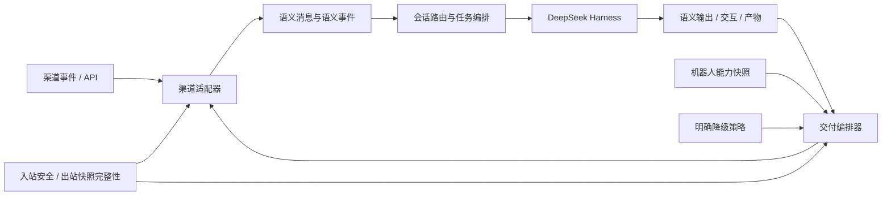
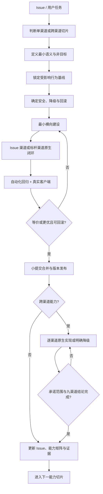

> **Retained upstream document.** This is the original `dsh-im` channel
> capability plan by [xmanrui](https://github.com/xmanrui), kept verbatim in
> Chinese as the historical design record for the nine channel integrations.
> It is not maintained by this fork and its status lines refer to upstream
> releases. For how this fork differs, see the README.

# dsh-im 渠道原生能力建设方案

> 总体策略：**横向建设统一语义，纵向逐个渠道打磨；按用户价值推进，按渠道特性落地。**

| 项目 | 内容 |
| --- | --- |
| 状态 | 执行版 v2；PR 链 1 已完成九渠道原生结果文件发送、自动化与本机发布验收，随本提交交付 |
| 更新日期 | 2026-08-23 |
| 代码基线 | 方案初次盘点基于 `@xmanrui/dsh-im@1.0.2`、`main@59ed364`，实施提交的父基线为 `main@2803bbc`；本机 `npm run check` 975/975 通过 |
| 适用范围 | 九个 IM 渠道；AI Office Connector 作为相邻消费者纳入回归边界，但不算第十个 IM 渠道 |
| 需求入口 | [#16 发送文件](https://github.com/xmanrui/dsh-im/issues/16)、[#27 Discord 自动创建 Thread](https://github.com/xmanrui/dsh-im/issues/27)、[#28 Telegram Rich Message](https://github.com/xmanrui/dsh-im/issues/28) |
| 领域语言 | [CONTEXT.md](../../CONTEXT.md) |
| 架构决策 | [ADR-0001：统一语义核心与渠道原生适配](../adr/0001-semantic-core-native-channel-adapters.md) |

## 1. 执行摘要

dsh-im 已经是一个具有九渠道多机器人管理、工作区与 Session 控制、Agent Preset、图片输入、问题审批和多种流式呈现的成熟插件，不再处于“先搭一套通用文字机器人”的早期阶段。统一方案的任务不是推倒现有架构，而是让真实用户问题驱动最小公共语义演进，并把渠道原生能力完整接回现有产品。

执行方式不是“先完成整套统一架构，再解决 Issue”，也不是“先在渠道里打补丁，以后再统一”，而是：

1. 从用户完成核心 Harness 任务的价值出发，确定能力切片的先后顺序。
2. 先锁定受影响渠道的行为基线，明确哪些功能必须保留、哪些体验准备改善、哪些能力纯属新增。
3. 把真实 Issue 转换为能力切片，只补闭环所需的最小统一语义、与实际边界匹配的安全/完整性规则和降级契约，不把一条边界的规则套到另一条边界。
4. 在 Issue 对应渠道用小提交完成原生实现、自动化回归和真实客户端闭环，并保持上一发布版本可回滚；跨渠道能力再选择标杆渠道扩展。
5. 依据每个渠道的原生能力、权限限制、稳定性和可测试性，分别决定原生实现或明确降级。
6. 在全部既有功能回归通过、承诺范围完成后，再进入下一项能力。

当前首批能力直接由三个真实 Issue 驱动，并根据已确认的用户价值和当前交付承诺排序：

1. **#16 结果文件回传**：最初由 DSH → 飞书 HTML/文件场景驱动；目前全局回传工具、Session/Turn 路由、文件快照完整性、九渠道原生发送路径和本机逐渠道验收均已完成，作为无需项目配置的默认能力提供。
2. **#27 Discord 会话落点与 Thread 隔离**：解决服务器频道多人共享同一 Harness Session 的正确性风险。
3. **#28 Telegram 原生 Rich Message**：保留 Markdown/结构化呈现意图，接入 Telegram Rich Message 与 Rich Message Draft。
4. 在前三个切片验证语义脊柱后，再推进原生审批/选择、引用内容、普通文件输入、语音和其他渠道富呈现。

三个 Issue 分别验证统一方案的三个关键边界：#27 验证会话路由和渠道原生动作，#16 验证文件快照、Session/Turn 路由与交付编排，#28 验证呈现意图和渠道原生渲染。它们必须形成三个独立 PR/提交链，不能捆绑成一次高风险重构。

## 2. 目标与非目标

### 2.1 目标

- 用户可以在手机端用最少输入完成 Harness 任务，而不是记忆命令或精确回复文字。
- Harness 能获得用户消息的完整任务上下文，包括引用内容、线程、文件和平台已提供的语音识别结果。
- Harness 可以通过全局回传工具把现有或新建的可读普通文件做成当前 Session/Turn 的完整快照，并以渠道原生附件回传。
- 同一业务语义在不同渠道保持一致，同时采用各渠道最自然的卡片、按钮、流式或消息编辑体验。
- 渠道缺少能力、权限不足或平台临时降级时，不静默丢失数据，用户始终得到明确反馈。
- 新能力可以通过公共契约、适配器合规测试和真实客户端清单稳定扩展，而不复制 Harness 业务逻辑。
- 语义迁移和渠道优化期间，当前已经可用的用户流程、控制命令、原生呈现、状态语义和安全边界全部保留；每次发布只能保持或改善体验，不能以一项新能力换掉另一项既有能力。

### 2.2 非目标

- 不追求覆盖每个 SDK 暴露的 API。
- 不因为平台支持贴纸、位置、联系人或投票就立即接入，除非它能显著改善 Harness 核心任务。
- 不在公共语义中暴露渠道原始 payload，避免核心层与平台字段耦合。
- 不为“接口统一”强迫所有渠道采用最低公分母体验。
- 不以简化架构、降低维护成本或赶进度为理由，删除或降级当前已经可用的渠道功能。
- 不把既有原生能力改成文字降级后仍宣称迁移完成；运行时临时故障降级不等于产品能力降级。
- 不建设用于决定路线图的渠道用户量统计或遥测系统。
- 不以新增第十、第十一个渠道作为当前阶段主要增长手段。

## 3. 当前基线与问题定义

### 3.1 1.0.2 已经具备的公共产品能力

以下能力是当前发布产品的基线，不是未来路线图：

| 基线类别 | 1.0.2 已有行为 |
| --- | --- |
| 渠道与账号 | 一个设置入口管理九个 IM 渠道；每个渠道支持多个机器人，凭据、连接状态、工作区、Agent Preset 和会话映射彼此隔离 |
| 安全接入 | 扫码、Manifest 或手工凭据接入；Secret/Token 只进入 Host 凭据存储，浏览器和状态 RPC 只获得脱敏投影 |
| 消息输入 | 九渠道均支持文字和受控图片输入；JPEG、PNG、WebP 及图片形式 GIF 支持可选说明，单图 5 MB、单消息合计 20 MB |
| Harness 会话 | 按机器人与聊天持久绑定 Session；支持工作区切换、Session 列表与绑定、模型查询与切换、停止、纠偏和上下文压缩 |
| Agent Preset | 每机器人独立选择或跟随 Host 默认；只影响之后新建 Session，不改变已有会话和在途回复 |
| 控制命令 | `/help`、`/new`、`/status`、`/models`、`/model`、`/presetlist`、`/preset`、`/stop`、`/steer`、`/compact`、`/workspace`、`/workspacelist`、`/sessionlist`、`/session` |
| Harness 交互 | 九渠道已经能够用文字完成问题与审批；Actor/Route 所有权、FIFO、重放去重、跨端解决、取消和失败重试已有大量自动化覆盖 |
| 回复体验 | 飞书/钉钉卡片流、企业微信/QQ/Slack 原生或准原生流、Telegram/Discord 编辑消息、WhatsApp typing + 最终消息；失败时已有安全恢复路径 |
| 运维可靠性 | 连接测试、自动重连、状态持久化、多机器人生命周期、并发竞态、工作区代际隔离、删除清理和敏感错误脱敏均已有测试资产 |

AI Office Connector 也已实现 `office-harness.v1`、Heartbeat/SSE、任务租约、独立 Harness Session、进度回传以及问题/审批闭环。它不是第十个聊天渠道，但证明了问题、审批、任务状态和终态幂等已经存在可复用的领域行为；后续语义演进不能破坏 Office。

### 3.2 当前代码结构已经形成两条成熟路径

- Discord、Slack、Telegram、WhatsApp 复用 [`TextHarnessBridge`](../../src/channels/shared/text-harness-bridge.mjs)。
- 飞书、钉钉、企业微信、QQ、微信保留独立 Bridge，以承载不同的流式、卡片、扫码协议和交互时序。
- 公共目录已经包含工作区/Session、模型、Agent Preset、问题、审批、图片安全、任务控制和可编辑消息流等成熟服务。
- 飞书已经拥有交互式菜单、Session/Workspace 卡片、Watch/完成推送、归档显示控制、回调修复、群响应模式和权限授权等明显超出“文字机器人”的渠道专属能力。

因此，当前问题不是“没有公共层”，而是**公共层在内容与交付边界仍偏文字化，渠道专属 Bridge 又没有共享完整的语义交付契约**。新方案必须复用成熟的会话、命令、交互和安全实现，只在三个 Issue 需要的位置增加语义接缝。

### 3.3 0.14 之后的迭代已经改变迁移前提

旧方案形成时使用的是 0.14 附近的代码认知。本次方案初次盘点使用 `main@59ed364`，实施前父基线更新至 `main@2803bbc`：它们包含 1.0.2 发布版，以及发布后的微信接入错误分类、UI 和图像资产更新。到这一基线，项目已经历多个稳定版本，至少新增或强化了：

- 飞书原生交互卡片、Session/Workspace 列表、会话 Watch 与完成推送、归档筛选、回调与群消息权限修复。
- 每机器人 Agent Preset 的设置页与聊天命令完整生命周期。
- Telegram 原生命令菜单与机器人级兼容/安全访问模式。
- 九渠道图片输入、工作区/Session/模型/控制命令和多机器人隔离的大量竞态与失败恢复测试。
- AI Office Connector 的外连协议、租约、问题审批和终态一致性。

这意味着 `TextHarnessBridge` 和各渠道独立 Bridge 都是生产资产。迁移不再以“新增一套新目录后替换旧类”为目标，而以**能力切片内的增量包裹、双路径验证和等价接管**为目标。

### 3.4 方案起点识别的真正有损边界

方案启动时识别出四个结构性缺口；其中第 3 项已由 PR 链 1 补齐，其余仍按独立能力切片处理：

1. **呈现意图变窄**：当前 `HarnessReplyTracker` 只从 `assistant/chunk` 和 `assistant/message` 保留文本，并故意不渲染 `tool/result`；这保护了工具结果中的敏感内容，但也使普通最终回答收敛为字符串。Telegram 因此无法使用 2026 年新增的 Rich Message/Rich Message Draft。
2. **会话路由过粗**：Discord 在父频道中被 @ 时直接使用父 `channel_id`，没有创建原生 Thread 的会话落点策略；已有 Thread 内消息可以按 Thread Channel ID 隔离，但父频道多人仍可能共享 Session。
3. **出站产物缺位（已补齐）**：方案起点只有图片输入安全链路和渠道 SDK 文件接口，没有 `OutboundArtifact → 渠道附件` 闭环。PR 链 1 已增加默认全局可用的 `dsh_im_return_file` 工具、Session/Turn 绑定、不可变文件快照和九渠道原生发送适配，并完成自动化与逐渠道本机证据留存；后续工作是提交和发布，而不是重新设计出站文件准入策略。
4. **能力声明不完整**：平台文档、锁定 SDK、当前代码和真实客户端之间仍缺少统一证据链，容易把“平台有 API”误写成“本项目可用”。

这些缺口不能笼统归因于“过度封装”：#28 主要暴露文字边界上限，#27 主要是 Discord 专属产品策略尚未实现，#16 则需要公共文件快照与各渠道上传适配。方案必须按原因分别处理。

### 3.5 三个 Issue 的能力切片映射

| Issue | 用户任务 | 统一语义最小增量 | 渠道原生实现 | 优先级 |
| --- | --- | --- | --- | --- |
| [#16 发送文件](https://github.com/xmanrui/dsh-im/issues/16) | 在当前聊天直接收到 Harness 要交付的现有或新建文件；首个确认场景是 DSH → 飞书的 HTML/文件回传 | 全局 `dsh_im_return_file`、Session/Turn 路由、`OutboundArtifact` 快照完整性和逐产物回执 | 已从飞书闭环扩展到默认可用的九渠道原生文件发送；格式、大小、权限和配额由渠道 API 决定 | P0：实现与本机验收已完成，随本提交交付 |
| [#27 Discord 自动创建 Thread](https://github.com/xmanrui/dsh-im/issues/27) | 在服务器频道 @ 一次开启独立对话，避免多人上下文串线和主频道刷屏 | `ConversationRoute.threadId`、最终会话落点和幂等路由；原始父消息 ID 只留在 Discord 动作上下文 | 查询 Channel 类型、从消息创建 Public Thread、在线程内回复；权限失败回到父频道现有路径 | P0：正确性与隔离 |
| [#28 Telegram Rich Message](https://github.com/xmanrui/dsh-im/issues/28) | 在 Telegram 中正确阅读标题、列表、代码、表格、公式和流式 AI 回答 | `DeliveryBlock(text.format)` 与呈现意图；不引入 Telegram 专属 Block 到核心 | `sendRichMessageDraft`、`sendRichMessage`，再降级到普通格式消息和纯文本 | P1：结果可读性 |

#16 正文只有 `todo`，但 2026-08-20 至 2026-08-21 的 Issue 讨论已明确确认 DSH → 飞书 HTML/文件回传是本 Issue 的目标场景。本方案因此将其限定为**出站结果产物回传**；用户向 Harness 发送普通文件属于后续独立切片。飞书作为首个闭环验证了公共产物契约，随后已扩展到其余八个渠道的原生发送路径。#27 和 #28 同样只增加闭环所需的最小语义，不要求其他八个渠道复制 Discord Thread 或 Telegram Rich Message UI。

### 3.6 当前功能是迁移资产，不是重构成本

每个能力切片都必须锁定以下用户可观察基线：

| 基线类别 | 必须保留的现有行为 |
| --- | --- |
| 消息接入 | 私聊、群聊提及/回复规则、文字、图片、去重、平台 ACK、消息顺序和安全错误提示 |
| 会话与任务 | 每机器人工作区与 Agent Preset、Session 创建/绑定/隔离、排队、并发、停止、纠偏和上下文压缩 |
| 控制命令 | 3.1 所列全部命令、参数规则、快车道语义、长列表拆分和不触发模型的行为 |
| Harness 交互 | 问题、审批、Actor/会话所有权、FIFO、重放、过期、取消、失败重试和跨端解决状态 |
| 渠道原生体验 | 当前流式/卡片/编辑式回复、typing、Reaction、飞书菜单/Watch/归档/修复、Telegram 访问模式和命令菜单 |
| 账号与运维 | 多机器人、扫码或凭据绑定、连接测试、自动重连、状态持久化、代理、权限修复、敏感信息保护和删除清理 |
| 相邻消费者 | AI Office 的协议握手、租约、进度、审批/问题和单一终态 |

矩阵中的每一项都必须关联现有自动化测试、事件 Fixture 或真实客户端清单。不同渠道原本不具备的能力不凭空列为基线，但某渠道已经拥有的原生体验不能因为其他渠道没有而降为最低公分母。

### 3.7 PR 链 1 当前实现状态

九渠道已经共享同一套结果文件回传语义：Host 启动时全局注册 `dsh_im_return_file`，首个 IM Turn 就可调用，不存在机器人级或请求级开关。工具接受绝对路径，或相对于当前 Harness 工作区的路径；现有文件和当前 Turn 新建的文件都可直接回传，不需要为交付而重新创建、改名或移入工作区。

插件只确认目标存在、可读且解析后是普通文件，随即复制到受管临时目录形成不可变快照，记录摘要并绑定调用时的 Session/Turn。发送前再校验快照大小、文件身份和内容摘要，防止内部快照被替换或损坏。这些是完整性与路由保证，不是文件准入策略。

出站回传不按文件来源、创建时间、工作区边界、符号链接、路径名、内容敏感度、扩展名、MIME、大小、数量、存活时间或独立读取超时做插件级拒绝；符号链接解析到可读普通文件时也允许回传。文件格式、大小、机器人权限、账号资格和配额均以实际渠道 API 结果为准；适配器将平台拒绝映射为稳定原因码和真实用户提示，不得在调用平台前自行收紧，也不得将本机路径伪装成用户可下载的文件。原有文字、图片、流式、命令、问题/审批与会话行为保持不变。

| 渠道 | 原生发送路径 | 平台权限与拒绝映射（插件不预判格式/大小） |
| --- | --- | --- |
| 微信 | iLink 加密 CDN 上传并发送原生文件 Item | 文件消息能力、大小、格式、配额与限流以 iLink/CDN 实际响应为准 |
| 飞书 | `im.v1.file.create` 上传后发送 `file_key` 文件消息 | 需租户权限 `im:resource`；内置扫码新建应用默认申请，已有或手动绑定应用仍需补权并完成必要审批；空文件、大小、所有权等以 API 错误为准，当前无单独的 `im:resource:upload` |
| 钉钉 | OAPI media 上传后发送机器人 `sampleFile` 消息 | 需 `qyapi_base` 和机器人文件消息能力；当前应用类型、消息模板、格式、大小与配额均以 OAPI 实际响应为准 |
| 企业微信 | `uploadMedia(type=file)` 后发送原生 Media Message | 素材上传、文件消息能力、格式、大小和限流以企业微信 API 实际响应为准 |
| QQ | SDK `sendFile` | 文件消息权限、格式、大小和当日上传配额以 QQ API 实际响应为准，配额耗尽时映射真实错误 |
| Slack | `files.getUploadURLExternal` 上传后 `files.completeUploadExternal` | 需 `files:write`；已有 App 变更 Scope 后必须重新授权/安装并重新连接；工作区策略、格式和大小以 Slack API 实际响应为准 |
| Telegram | Bot API `sendDocument` | 机器人需有当前聊天的文档发送权限；格式、大小和限流以 Bot API 实际响应为准 |
| Discord | 消息 Multipart Attachment | 需 **Send Messages**、**Attach Files** 与 **Read Message History**；当前账号/频道的动态附件上限和限流以 Discord API 实际响应为准 |
| WhatsApp | Baileys Document Message | 文档能力、格式、大小和限流以当前关联账号与服务端实际响应为准 |

“代码已实现”不替代真实客户端证据。本轮已按 18.4 为每个渠道各选一个机器人完成原生附件、内容一致性和既有能力回归验收；权限、SDK、平台或客户端版本变化后仍须重新验收。README 只能声明源码已经提供的能力、必要权限和已验证的错误映射，不应把某次平台拒绝值再实现成插件固定上限。

### 3.8 PR 链 1 本机验收记录（2026-08-23）

本表只记录本次锁定代码、当前机器人权限和客户端上的结果，不把一次验收外推成平台永久保证。本轮留证使用了当前 Turn 生成的测试文件，但这只是验收样例，不是产品准入条件；自动化契约同时锁定现有文件和新建文件均可回传。

| 渠道 | 原生文件与内容一致性 | 既有能力回归 | 结论 |
| --- | --- | --- | --- |
| 飞书 | TXT、HTML 原生文件均收到，内容与源文件一致 | 真机文字路径通过 | 通过 |
| 微信 | 原生文件 Item 收到，内容与源文件一致 | 真机文字路径通过 | 通过 |
| 钉钉 | ZIP 原生文件收到并下载核对一致 | 真机文字路径通过 | 通过 |
| 企业微信 | 原生文件收到，本地接收缓存的摘要与内容一致 | 真机文字路径通过 | 通过 |
| QQ | 原生文件卡片收到，并通过客户端动作核对内容一致 | 真机文字路径通过 | 通过 |
| Telegram | 原生 Document 收到，大小与源文件一致 | 真机文字路径通过 | 通过 |
| Discord | 原生 Attachment 收到，文件名、大小和源文件一致 | 生产装配自动化通过；本轮客户端未出现额外重复消息 | 原生路径与回归证据通过 |
| WhatsApp | 原生 Document 收到；修复自聊回显早于 ACK 导致的重复处理后复测通过 | 真机文字路径通过 | 通过 |
| Slack | 补齐 `files:write` 并重新安装 App 后，TXT 原生文件收到；经 Slack 客户端下载，32 字节内容和 SHA-256 与源文件一致 | 真机文字路径通过 | 通过 |

## 4. 第一性原理与设计原则

### 4.1 从用户任务而不是平台 API 出发

每项能力必须回答：

1. 用户想完成什么 Harness 任务？
2. 当前体验在哪一步产生输入、理解、等待或取回结果的成本？
3. 渠道原生能力能否显著降低这个成本？
4. 不支持该能力时，怎样保持任务仍可完成？

无法回答以上问题的 SDK 能力不进入近期路线图。

### 4.2 统一语义，不统一表现

- “批准一次”是统一语义。
- 飞书卡片按钮、Telegram Inline Keyboard、Slack Block Kit 是原生表现。
- “精确回复批准”是降级表现，不应成为核心模型。

### 4.3 能力属于机器人实例，不只属于渠道

同一平台的不同机器人可能因为权限、应用类型、账号资格、API 版本或客户端限制拥有不同能力。系统必须同时维护：

- **声明能力**：代码和 SDK 理论上可以提供的能力。
- **配置能力**：当前凭据、Scopes 和应用设置允许的能力。
- **已验证能力**：启动探测或真实调用已经确认可用的能力。
- **临时降级**：配额、接口故障或客户端差异导致当前不可用的能力。

产品界面和日志只能依据当前机器人实例的能力快照声明“可用”，不能依据平台宣传页直接声明。

### 4.4 不允许静默丢失

收到无法处理的文件、语音或交互事件时，适配器必须产生以下结果之一：

- 成功转换为语义内容；
- 明确降级；
- 向用户说明当前限制；
- 记录可观测的拒绝原因。

禁止把未知消息归一化为空字符串后无声忽略。

### 4.5 入站安全与出站完整性分开收口

远程下载、回调身份、交互重放、入站大小限制和日志脱敏必须由公共安全策略约束；渠道适配器不能绕过。出站本地文件是另一条边界：公共层只保证目标是存在、可读的普通文件，绑定 Session/Turn 并保证快照完整性；不把入站下载的域名、格式、大小和内容扫描规则套到出站。

### 4.6 以渠道行为基线为发布下限

每个能力切片必须把改动标记为以下三类之一：

- **保留**：迁移后用户可观察语义必须不变，测试不得被删除或弱化。
- **改善**：明确写出改善前后的体验差异，同时保留原任务的可完成性、状态和安全不变量。
- **新增**：只增加能力，不改变无关的既有路径。

本方案不允许“删除”类别。若未来确实需要移除产品功能，必须脱离本方案单独决策；不能把它隐藏在重构、统一接口或渠道适配中。

新路径只有在覆盖受影响的渠道行为基线、通过全量回归、完成真实客户端验证并具备可执行回滚后才能等价接管。优化某个渠道不得修改其他渠道的处理权、能力声明或用户可见结果，除非那些渠道也在本切片的明确范围内并完成同等验收。

## 5. 目标架构



### 5.1 分层职责

#### 渠道运行时

负责连接、鉴权、重连、Webhook 或长连接、平台 ACK、限流和原始事件接收。它不决定 Harness 业务流程。

#### 渠道适配器

负责两种转换：

- 平台事件 → 语义消息、语义交互响应或生命周期事件。
- 语义输出 → 卡片、按钮、附件、流式更新或文字降级。
- 在渠道策略明确要求时执行渠道原生动作，例如从 Discord 父消息创建 Thread；动作完成后只把最终 `ConversationRoute` 交给语义核心。

适配器可以保留一个仅供本渠道后续发送使用的不可序列化路由句柄，但不能让平台原始 payload 进入 Harness 核心。

#### 语义核心

负责会话路由、消息排队、Prompt 构造、审批所有权、交互超时、入站产物安全、出站快照完整性、幂等和降级决策。这里不得引用飞书、Telegram 等平台字段名。

#### Harness 网关

负责把语义内容转换为 Harness 可接受的输入，监听文本、工具、问题、审批、进度和产物事件，并转换成语义输出。

现有 `HarnessClient`、问题/审批监听器、Workspace Session 和 AI Office Job 执行器继续作为事实实现。新网关先在其外部补充结构化输出，不重新实现已经稳定的 RPC、所有权和代际隔离。

#### 交付编排器

根据语义输出、能力快照和降级策略选择呈现方式，维护发送回执、更新句柄和失败恢复。

### 5.2 增量落地位置

语义模块按前三个 Issue 的真实需要懒加载创建，不预先生成完整目录或移动现有渠道文件：

```text
src/channels/shared/semantic/
├── conversation-route.mjs      # #27 首次落地：稳定路由与 Session 键
├── artifact.mjs                # #16 首次落地：受控产物句柄与注册表
├── delivery.mjs                # #16/#28 首次落地：呈现意图与交付回执
├── capability.mjs              # 某切片需要运行时能力判断时再创建
├── interaction.mjs             # 原生审批/选择切片开始时再包裹现有队列
└── fallback-policy.mjs         # 跨渠道出现第二种降级决策时再抽取
```

不强制新增统一的 `<channel>-adapter.mjs` 文件；能力可以先在当前 Runtime/API/Bridge 内通过小型适配函数落地。只有当一个渠道至少有两个能力切片共享稳定边界时，才抽出专用 Adapter。

`TextHarnessBridge`、五套专用 Bridge 和公共命令/会话服务在迁移期间继续作为兼容入口。只有当其承载的全部渠道行为基线已经由新路径覆盖、公共行为测试和渠道真机验收均完成且至少经历一个稳定发布周期后，才可以缩减或删除；删除实现不等于删除任何功能。

## 6. 统一语义模型

以下接口是设计契约，不要求第一阶段一次实现全部字段。所有持久化结构必须有 `schemaVersion`，新增字段默认向后兼容；仅在内存中使用的过渡对象可以先由运行时校验器保证形状，确认需要持久化后再版本化。

### 6.1 会话路由

```ts
interface ConversationRoute {
  schemaVersion: 1;
  channel: ChannelKey;
  botId: string;
  scope: 'direct' | 'group';
  peerId: string;
  threadId?: string;
}

interface ReplyReference {
  messageId: string;
  authorId?: string;
  parts?: MessagePart[];
  unavailableReason?: 'not-delivered' | 'expired' | 'permission-denied';
}
```

规则：

- Harness Session 绑定键由完整 `ConversationRoute` 生成。
- 平台具有 Thread/Topic 时，`threadId` 必须参与会话隔离。
- 需要先创建渠道原生 Thread 时，适配器先完成创建或明确失败回退，再生成唯一的最终路由；不允许父频道和新 Thread 各绑定一次同一 Turn。
- Discord 从消息建 Thread 时，原始消息 ID 用于渠道 API 与幂等处理，不进入持久的公共 Session 键；最终 `threadId` 才是子会话标识。
- 单纯回复一条消息不自动创建新 Session；引用内容通过 `ReplyReference` 进入 Prompt。
- 同一平台的不同机器人必须隔离，即使其平台 Chat ID 相同。

### 6.2 语义消息

```ts
interface SemanticMessage {
  schemaVersion: 1;
  eventId: string;
  providerMessageId: string;
  route: ConversationRoute;
  actor: {
    id: string;
    displayName?: string;
    isBot: boolean;
  };
  occurredAt?: number;
  addressed: boolean;
  parts: MessagePart[];
  replyTo?: ReplyReference;
}

type MessagePart =
  | { kind: 'text'; text: string; format: 'plain' | 'markdown' }
  | { kind: 'image'; artifact: InboundArtifact }
  | { kind: 'file'; artifact: InboundArtifact }
  | { kind: 'audio'; artifact?: InboundArtifact; transcript?: string; transcriptSource?: 'platform' | 'local' }
  | { kind: 'video'; artifact: InboundArtifact }
  | { kind: 'unsupported'; nativeType: string; userMessage: string };
```

约束：

- `parts` 保持用户发送顺序，图文混排不能拆成互不相关的 Prompt。
- 有平台识别文本时优先保留 `transcript`，例如钉钉、企业微信和微信。
- `unsupported` 是显式结果，不等于“支持未知内容”；它确保不会静默丢弃。
- 联系人、位置、投票等暂不进入 v1 核心类型，出现时先转换成 `unsupported`，待真实需求证明价值后再建模。

### 6.3 语义交互

```ts
interface SemanticInteraction {
  schemaVersion: 1;
  interactionId: string;
  kind: 'approval' | 'single-select' | 'multi-select' | 'free-text';
  route: ConversationRoute;
  actorId: string;
  title: string;
  description?: string;
  options?: Array<{
    id: string;
    label: string;
    description?: string;
    intent?: 'primary' | 'danger' | 'default';
  }>;
  expiresAt: number;
  harness: {
    sessionId: string;
    rpcId: string;
  };
}

interface InteractionResponse {
  interactionId: string;
  actorId: string;
  selectedOptionIds?: string[];
  text?: string;
  providerEventId: string;
}
```

安全和一致性规则：

- 平台按钮只携带随机、无业务敏感信息的短令牌，完整映射保存在本机。
- 响应必须绑定 `interactionId + actorId + route + expiresAt`。
- 第一份合法响应胜出；重复点击、跨用户点击和过期回调必须幂等拒绝。
- 处理完成后，支持更新卡片的渠道应禁用按钮或显示结果。
- 原生控件不可用时，统一降级成编号或精确文字回复，但复用同一个交互所有权和校验流程。

### 6.4 产物

```ts
interface InboundArtifact {
  id: string;
  name?: string;
  mediaType?: string;
  declaredSize?: number;
  source: 'channel';
  open(options: { signal: AbortSignal; maxBytes: number }): Promise<Readable>;
}

interface OutboundArtifact {
  kind: 'dsh-im-outbound-artifact';
  schemaVersion: 1;
  artifactId: string;
  deliveryKey: string;
  fileName: string;
  mediaType: string;
  size: number;
  digest: string;
  source: 'managed-temp';
  registeredBy: {
    kind: 'tool-result';
    eventId: string;
    toolName: 'dsh_im_return_file';
  };
  origin: {
    sessionId: string;
    turn: number;
    callId: string | null;
  };
  createdAt: number;
}
```

`dsh_im_return_file` 的入参是本地路径，但交给渠道适配器的产物不再是该路径，而是调用时创建的受管快照。`mediaType`、`size`、`source` 和 `createdAt` 是传输元数据，不是准入条件；快照没有产物 TTL。只有工具成功结果会提交到调用时的 Session/Turn，适配器通过快照读取文件，不向远端用户暴露 Host 绝对路径。

### 6.5 语义输出与进度

```ts
type DeliveryBlock =
  | { kind: 'text'; text: string; format: 'plain' | 'markdown' }
  | { kind: 'artifact'; artifact: OutboundArtifact; caption?: string }
  | { kind: 'interaction'; interaction: SemanticInteraction }
  | { kind: 'status'; state: 'thinking' | 'tool-running' | 'completed' | 'stopped'; text?: string };

interface SemanticDelivery {
  schemaVersion: 1;
  route: ConversationRoute;
  replyToMessageId?: string;
  blocks: DeliveryBlock[];
}

interface DeliveryReceipt {
  schemaVersion: 1;
  deliveryId: string;
  presentation: string;
  providerMessageIds: string[];
  artifacts?: Array<{
    artifactId: string;
    outcome: 'sent' | 'rejected' | 'failed' | 'unknown';
    reason?: string;
  }>;
}
```

Harness 输出的 Markdown 作为语义文本保存，渠道适配器负责转换到 MarkdownV2、mrkdwn、卡片 Markdown、Discord Markdown、WhatsApp 格式或纯文本。禁止在核心层提前转换成某个平台语法。

## 7. 渠道能力模型

### 7.1 能力快照

```ts
interface ChannelCapabilitySnapshot {
  channel: ChannelKey;
  botId: string;
  observedAt: number;
  input: {
    image: CapabilityState;
    file: CapabilityState;
    audio: CapabilityState;
    platformTranscript: CapabilityState;
    replyReference: CapabilityState;
    thread: CapabilityState;
    editEvent: CapabilityState;
  };
  output: {
    markdown: CapabilityState;
    richMessage: CapabilityState;
    file: CapabilityState;
    nativeStream: CapabilityState;
    editableMessage: CapabilityState;
    typing: CapabilityState;
    buttons: CapabilityState;
    singleSelect: SelectionCapability;
    multiSelect: SelectionCapability;
  };
  actions: {
    createThreadFromMessage: CapabilityState;
  };
  limits: {
    textChars?: number;
    artifactBytes?: number;
    actionCount?: number;
  };
}

type CapabilityState =
  | { state: 'verified' }
  | { state: 'permission-required'; reason: string }
  | { state: 'degraded'; reason: string }
  | { state: 'unavailable'; reason: string };

interface SelectionCapability {
  capability: CapabilityState;
  presentation: 'native-control' | 'composed-interaction' | 'text-fallback';
  limitations?: string[];
}
```

单选和多选不能只记录“支持/不支持”。`native-control` 表示平台一次提交就返回完整选择结果；`composed-interaction` 表示用多次按钮回调、本地暂存和明确的“完成”动作组合出同一语义；`text-fallback` 表示编号或精确文字回复。组合交互不是原生多选，产品文案和能力统计不得把二者混为一谈。

### 7.2 能力来源

能力快照按以下优先级生成：

1. 启动时可安全执行的 API/Scope 探测。
2. SDK 和应用配置提供的明确权限信息。
3. 最近一次真实调用结果及带 TTL 的降级状态。
4. 代码内保守的静态声明。

探测不能发送用户可见消息、修改平台设置或扩大权限。无法确认时视为 `permission-required` 或 `unavailable`，不能乐观声明。

### 7.3 适配器契约

```ts
interface ChannelAdapter {
  describeCapabilities(context: BotContext): Promise<ChannelCapabilitySnapshot>;
  normalizeEvent(event: unknown, context: BotContext): Promise<SemanticEvent | null>;
  deliver(message: SemanticDelivery, context: BotContext): Promise<DeliveryReceipt>;
  update?(receipt: DeliveryReceipt, message: SemanticDelivery, context: BotContext): Promise<DeliveryReceipt>;
  resolveReference?(reference: ProviderReference, context: BotContext): Promise<ReplyReference>;
}
```

关键约束：

- `normalizeEvent` 必须对已 ACK 的用户可见消息给出语义事件或明确拒绝，不得静默吞掉。
- `deliver` 接收语义，不接收 Harness RPC 对象。
- 适配器不能自行决定审批结果、Session 绑定，也不能将其他 Session/Turn 的文件快照交付到当前聊天。
- `DeliveryReceipt` 必须记录实际采用的呈现方式，例如 `native-card`、`edit-stream` 或 `text-fallback`，用于观测和后续更新。

## 8. 明确降级策略

降级策略由公共层统一选择，渠道适配器执行。每次降级必须产生原因码和可观测记录。

| 语义能力 | 首选呈现 | 第二选择 | 最终降级 |
| --- | --- | --- | --- |
| 审批 | 原生批准/拒绝按钮 | 原生单选 | 精确文字回复 |
| 单选 | 原生单选或按钮 | 编号按钮 | 编号文字回复 |
| 多选 | 原生多选 | 组合交互（勾选/取消 + 明确“完成”） | 逗号分隔的编号文字 |
| 流式回答 | 平台原生流式 | 编辑同一消息/更新卡片 | typing + 最终消息 |
| Markdown | 渠道原生富文本 | 渠道方言转换 | 可读纯文本 |
| 文件回传 | 原生附件 | 平台允许的原生媒体消息 | 明确告知平台返回的权限、大小、格式、配额或临时故障原因；不暴露本机路径或上传到未授权第三方 URL |
| 引用上下文 | 事件自带快照 | 在权限和时限内按消息 ID 获取 | 在 Prompt 中标记引用内容不可用，并提示用户补充 |
| 语音输入 | 平台识别文本 | 明确启用的本地转写 | 告知当前渠道暂不能处理语音 |

降级不应改变安全边界。例如平台不能发文件时，不能临时把本地文件上传到未授权公共图床；这一原则不等于在调用原生 API 前增加插件格式或大小限制。

明确降级也不能被用来掩盖迁移回归：如果某渠道当前已经提供原生流式、卡片、typing、图片输入、语音识别、Thread 或其他能力，新语义路径必须保留或改善该能力，不能永久退回文字方案。只有该能力原本不存在，或平台接口在运行时暂时不可用时，才能按本表降级；临时降级恢复后仍应自动回到原生路径。

## 9. 入站下载安全与出站文件回传

### 9.1 入站产物下载安全

统一复用并泛化现有图片安全机制：

1. 渠道适配器只提供受控下载句柄，不直接把平台 URL交给 Harness。
2. 仅允许 HTTPS 和平台白名单域名；默认拒绝重定向。
3. 同时检查声明大小和流式实际大小。
4. 对文件签名、MIME 和扩展名进行一致性检查；不信任用户文件名。
5. 文件名移除路径、控制字符和超长内容。
6. 下载受超时、AbortSignal、单文件上限和单消息总量限制。
7. 临时文件使用受控目录和随机名称，任务结束或 TTL 到期后清理。
8. 默认不把音视频上传第三方转写服务；需要时必须形成单独产品和隐私决策。

本节只适用于“从渠道服务器下载用户输入到本机”的入站边界。HTTPS、域名白名单、重定向、声明/实际大小、MIME/签名/扩展名、文件名、下载超时和临时文件 TTL 都是入站下载规则，**不得用来限制 `dsh_im_return_file` 回传的本地文件**。

### 9.2 出站工具与路由

当前事实契约不再依赖尚未证实的 `artifact/produced` 事件或工具白名单，而是 Host 提供的显式工具：

1. `dsh_im_return_file` 在 Host 启动时全局注册，对九渠道和所有已连接机器人默认可用，包括会话的首个 IM Turn。
2. 不增加项目、机器人或单次请求开关，不要求用户先启用任何“文件回传”配置。
3. 用户要求收到文件时，Harness 直接以路径调用该工具；现有文件和新建文件的语义完全相同，不需要重新创建或改名。
4. 工具的成功结果按调用时的 Session/Turn 提交，并且只能被该 Turn 的 IM 交付路径取走；失败、取消或其他 Turn 不能跨路由发送。

这是工具调用与消息路由契约，不是对文件的来源等级或创建时间判定。

### 9.3 出站文件快照与平台交付

插件仅执行以下本地契约：

- 路径可以是绝对路径，也可以相对于当前 Harness 工作区；不限制解析后的普通文件必须留在工作区内。
- 目标必须已存在、可读且是普通文件。目录、设备文件、Socket 和命名管道不是可发送文件；符号链接解析到可读普通文件时可以发送。
- 工具调用时立即把文件复制到受管临时目录，保存大小和 SHA-256 摘要；之后原路径的变化不改变已登记的交付内容。
- 适配器发送前打开受管快照，完整读取并重新校验文件身份、大小和摘要；任何不一致均按快照损坏处理。
- 快照精确绑定工具调用时的 Session/Turn；有 IM 消费者时保留到渠道领取并在发送进入终态后释放，无消费者、消费端退出或 Turn 取消时立即清理未交付快照。这只是资源生命周期，不改变工具可见性或文件准入。

插件不扫描、拒绝或改写文件内容，不根据来源、创建时间、工作区边界、路径是否经过符号链接、文件名/扩展名、MIME、敏感内容、文件大小、文件数量、TTL 或插件独立读取超时做准入决策。出站格式、大小、权限、配额和限流由对应平台 API 决定；平台的真实错误必须映射到稳定原因码和用户可理解的提示。

### 9.4 交付语义

- 文本和产物属于同一个 `SemanticDelivery`，适配器可依据平台限制拆成多条消息。
- 每个产物生成独立回执，部分失败不能伪装成整体成功。
- 可重试错误应复用同一个幂等键，避免发送重复附件。
- 最终回复必须明确列出成功、本地文件不可用、快照完整性失败和被平台拒绝的产物。

## 10. 引用、Thread 与会话隔离

### 10.1 引用内容

用户回复“把这个改一下”时，Prompt 至少包含：

```text
[当前用户消息]
把这个改一下

[引用消息]
作者：机器人
内容：...
附件：report.csv
```

引用内容来自事件快照时直接归一化；需要额外拉取时必须服从平台权限、时效和与当前会话的归属检查。禁止根据用户可控 ID 拉取其他聊天中的消息。

### 10.2 Thread 与 Topic

- Slack Thread、Telegram Topic、Discord Thread/Channel 和飞书回复链必须映射到稳定 `threadId`。
- 平台没有 Thread 时保持聊天级 Session，不创造伪线程。
- Discord 父频道消息创建 Thread 的动作必须发生在 Session 查找之前；Discord 官方接口使创建后的 Thread ID 与源消息 ID 相同，应利用这一性质收敛 Gateway 重放和并发创建。
- 对 Discord DM 和已在 Thread 中的消息不执行新建动作；新建 Thread 不继承父频道历史 Session，创建或发送失败则整体回到当前父频道路径，不保留半绑定状态。
- 会话键迁移时保留旧绑定读取兼容：优先查新键，未命中且无 `threadId` 时读取旧键并原子迁移。
- 对飞书等当前按群 Chat ID 绑定的渠道，带 `root_id` 的新消息启用新键后，不自动把整个群旧 Session 复制到所有话题。

### 10.3 并发与所有权

- 同一会话路由内继续串行处理普通 Turn。
- 不同 Thread 可以并行，互不抢占队列。
- 审批与问题沿用现有 Harness 交互所有权原则，额外绑定渠道 Actor 和 Route。
- 用户在 Harness 桌面端先完成交互后，渠道按钮必须显示已处理，后续点击幂等返回。

## 11. 原生交互方案

### 11.1 单选与多选形式核对

以下结论以 2026-08-23 的官方资料、当前上游协议和本项目锁定依赖为依据。依赖快照包括 `@tencent-connect/qqbot-connector@1.2.0`、`@tencent-connect/qqbot-nodejs@1.0.4`、`@wecom/aibot-node-sdk@1.0.7`、`dingtalk-stream@2.1.4`、`@larksuiteoapi/node-sdk@1.73.0` 和 `@whiskeysockets/baileys@7.0.0-rc14`；Slack、Telegram 和 Discord 为项目内直接调用 HTTP/WebSocket API。升级依赖或切换接入协议后必须重新核对。这里严格区分四种结论：

- **原生**：平台或当前接入协议有明确控件，一次提交返回一个或多个选择值。
- **组合**：平台没有原生多选控件，通过多次按钮回调、选中状态和“完成”动作实现。
- **文字**：当前接入形式没有可靠交互控件，使用编号或精确文字回复。
- **待确认**：资料或当前 SDK 只能证明局部能力；真机闭环前不得对外声称支持。

“平台/上游存在”不等于“本项目已经可用”。只有当前锁定依赖能够发送、接收回调、校验操作者、完成 Harness 响应并更新最终状态，且经过真实移动端测试，才能在能力快照中标为 `verified`。

| 渠道 | 单选形式结论 | 多选形式结论 | 当前项目原生/组合路径状态 | 实施决策 |
| --- | --- | --- | --- | --- |
| 飞书 | **原生已证实**：消息卡片 Button、`select_static` 单值选择器 | **待确认**：当前可核对的官方交互资料只明确返回单个 `option`，没有足够证据把“卡片多选”标为原生支持 | **未接入**：Harness 问题仍走文字响应，未形成卡片 Action 回调闭环 | 单选采用原生卡片；多选先用当前 CardKit 模板和锁定 SDK 真机验证，证实前使用组合按钮或文字降级 |
| 钉钉 | **原生已证实**：互动卡片 Button + Stream 卡片回调 | **待确认**：官方 Stream 回调资料证明卡片动作，但尚未证明当前卡片模板存在可用的原生多选组件 | **未接入**：运行时只监听机器人消息 Topic，未监听卡片实例回调 Topic | 单选采用互动卡片；多选先验证卡片平台模板，失败时使用组合按钮或文字降级 |
| 企业微信 | **原生已证实**：模板卡片 `button_selection`，或 `vote_interaction` 中 `checkbox.mode = 0` | **原生已证实**：`vote_interaction` 中 `checkbox.mode = 1`，当前 SDK 类型最多 20 个选项 | **未接入**：现有 Bridge 使用文字交互，未处理 `template_card_event` | 审批优先按钮；普通单/多选使用模板卡片，并在平台要求的时限内响应和更新。`multiple_interaction` 不直接等同于“原生多选” |
| QQ | **原生已证实**：Inline Keyboard Button，Interaction 回调返回单次按钮值 | **无原生控件**：可用多次按钮回调 + 选中标记 +“完成”组合，更新或补发体验需真机验证 | **未接入**：当前 QQ Runtime 未注册 SDK `interaction` 事件，Harness 问题走文字 | 单选采用 Keyboard；多选仅在消息更新、回调次数和群聊权限通过真机验收后采用组合交互，否则文字降级 |
| Slack | **原生已证实**：Block Kit Button、Static Select、Radio Buttons | **原生已证实**：Multi-select 或 Checkboxes；Static Multi-select 最多 100 个选项 | **未接入**：当前发送未使用 `blocks`，Socket Mode 未处理交互 Payload | 单/多选均采用 Block Kit，ACK 后更新原消息并关闭交互 |
| Telegram | **原生已证实**：Inline Keyboard Button + Callback Query | **无原生控件**：使用多次 Callback Query、勾选标记和“完成”按钮组合 | **未接入**：`allowed_updates` 仅包含 `message`，发送未带 `reply_markup` | 单选采用 Inline Keyboard；多选采用组合键盘，失败时文字降级；每次点击先 `answerCallbackQuery` 再编辑键盘 |
| Discord | **原生已证实**：Button，或 `String Select` 设置 `max_values = 1` | **原生已证实**：`String Select` 设置 `max_values > 1`，一次交互返回 `values`，最多 25 个选项 | **未接入**：当前消息未带 `components`，Gateway 只处理 `MESSAGE_CREATE`，未处理 `INTERACTION_CREATE` | 单/多选均采用 Message Components，Interaction ACK 后更新消息并禁用组件 |
| 微信 | **当前协议不支持原生控件**：iLink 消息项只有文字、图片、语音、文件和视频等内容类型 | **当前协议不支持原生控件** | **文字可用**：现有接入可继续用编号或精确文字回答 | 保持简洁文字单选/多选，不模拟脆弱的私有卡片；协议新增正式能力后再复验 |
| WhatsApp | **当前上游有原生投票**：Baileys Poll 的 `selectableCount = 1` | **当前上游有原生投票**：`selectableCount > 1` 可表达多选 | **不可端到端使用**：当前 Session 的 `getMessage` 返回 `undefined`，且未监听 `messages.update`，无法可靠解密和汇总投票更新 | 投票只用于普通问题；补齐投票原消息存储、更新聚合、Actor/Route 绑定和真机测试后再启用。未证明不可更改和唯一操作者前，投票不得用于危险审批 |

飞书和钉钉的多选结论故意标为“待确认”，而不是根据卡片能力名称推断“应该支持”。WhatsApp 的 Poll 是投票语义，不天然等同于一次性审批；Telegram、QQ 的组合多选也必须明确显示当前选择和“完成”，不能把任意一次点击误当最终答案。

### 11.2 每渠道强制确认记录

单选和多选分别建立一条能力记录，共九个渠道十八条；不得用一条“交互支持”同时代替两项。每条记录至少包含：

| 字段 | 必须回答的问题 |
| --- | --- |
| `presentation` | 原生控件、组合交互还是文字降级？控件或协议的准确名称是什么？ |
| 发送证据 | 当前锁定依赖能否创建并发送？需要什么应用类型、Scope、权限和模板发布步骤？ |
| 回调证据 | 实际 Payload 返回单值还是数组？是否包含 Actor、Route、消息和交互 ID？ |
| 限制 | 最大选项数、标签长度、超时、回调 ACK 时限、私聊/群聊差异和客户端差异是什么？ |
| 完成语义 | 单选何时立即完成？多选是否必须点击“完成”？能否取消或修改？ |
| 最终状态 | 能否更新原消息、禁用控件并显示选择结果？更新失败时如何补发权威结果？ |
| 安全与可靠性 | 如何防止跨用户、跨会话、重复回调、过期点击和平台重试造成重复执行？ |
| 降级与回滚 | 原生发送或回调失败时如何回到现有文字路径，且不双回复、不丢失待处理问题？ |
| 验收证据 | 契约 Fixture、自动化用例、iOS/Android 真机记录、测试日期和锁定 SDK 版本在哪里？ |

验证状态按 `docs-checked → connector-proved → real-client-proved` 推进。只有 `real-client-proved` 可以映射为运行时 `verified`；只看到官方文档、只在 SDK 中发现类型、或只成功发出卡片，都不能算项目支持。

### 11.3 交互渲染要求

- 危险操作的“拒绝”不得使用弱可见样式。
- 按钮标签短而明确，不把完整工具参数塞入按钮值。
- 工具名、关键参数和原因在卡片正文中可审查；超长参数安全截断并提示。
- 移动端首屏应能看到问题和主要操作，避免用户必须展开长日志才能审批。
- 原生交互与文字降级共享同一状态机，不维护两套审批队列。
- 审批与单选共享“选择一个结果”的结构，但不共享风险判断；投票、可修改选择或无法确认操作者的控件不能用于危险审批。
- 组合多选必须明确展示已选项、允许取消选择并提供单独的“完成”动作；不得把最后一次按钮点击直接当作最终多选答案。

## 12. 语音、文件与富内容输入

### 12.1 语音策略

优先级如下：

1. 使用平台已经提供的识别文本，首先补齐钉钉；企业微信和微信保持现有能力。
2. 对只提供音频文件的渠道，先作为 `audio` 产物进入语义层。
3. 只有在 Harness 或本机具有明确转写能力时才转写，并标注 `transcriptSource`。
4. 未启用转写时明确提示，不静默忽略。

语音的原始音频是否同时进入 Harness 由具体任务能力决定；仅有转写文本时不伪装成已经分析语调或音频细节。

### 12.2 普通文件输入

- v1 优先支持文本、代码、PDF、常见办公文档和压缩包的安全传递，不承诺 Harness 一定能理解所有格式。
- 渠道负责下载，公共层负责安全注册，Harness 负责决定是否读取。
- UI 文案区分“机器人成功接收文件”和“Harness 已成功解析文件”。
- 多文件消息保持顺序和文件名，不把每个附件拆成独立 Session Turn。

### 12.3 富文本输入

- 保留链接 URL、链接文本、代码块和段落边界。
- @机器人属于路由元数据，从 Prompt 中移除；对其他人的 @ 是否保留由群聊语义决定。
- Embedded、Block、Post 等平台结构转换成语义 Markdown 或可读纯文本，不能只取 fallback text 后丢失链接目标。

## 13. 渠道原生呈现

### 13.1 统一进度事件

Harness 进度统一为：

```text
thinking → tool-running* → answer-updating* → completed | stopped | failed
```

渠道可选择以下呈现策略，但语义状态保持一致：

- 原生流：Slack、企业微信、QQ C2C 等已验证能力。
- 卡片更新：飞书、钉钉。
- 消息编辑：Telegram、Discord。
- typing + 最终消息：微信、WhatsApp 或临时降级渠道。

工具进度必须节流和去重，避免移动端连续刷屏。失败后只能有一个权威最终状态。

### 13.2 Markdown 与代码

- Harness Markdown 先经过安全、可测试的解析或转换层，不用零散正则为每个平台补丁式转义。
- 代码块优先保证内容完整和可复制，其次才是语法高亮。
- 链接必须保留目标地址；不允许因富文本降级只剩链接标题。
- 超过渠道长度限制时按段落或代码块边界拆分，不能从 UTF-16 surrogate 或 Markdown delimiter 中间切断。
- 渠道不支持表格时转换为列表或等宽文本。

## 14. 当前九渠道能力基线

下表保留 1.0.2 的行为基线，并移除 PR 链 1 已补齐的出站结果文件缺口；九渠道当前结果文件发送路径及限制见 3.7。平台能力仍可能变化，表中“文字”表示 Harness 交互目前依赖现有安全文字状态机，不表示功能缺失。

| 渠道 | 当前输入基线 | 会话与路由基线 | 当前原生/专属呈现 | Harness 交互 | 剩余重点 |
| --- | --- | --- | --- | --- | --- |
| 飞书 | 文字、图片、Post 图文；群聊支持仅提及或经授权接收全部消息 | 私聊/群聊隔离；回复链用于待处理问题关联，尚未形成统一 Thread Session 语义 | CardKit 流式、Reaction；原生菜单、Session/Workspace 卡片、Watch 完成推送、归档筛选、回调与群权限修复 | 问题/审批文字闭环；管理卡片按钮已可用，但 Harness 问题尚未原生化 | 引用/回复链语义；Harness 原生选择；语音 |
| 微信 | 文字、图片、平台语音识别文本；账号所有者隔离 | 账号/聊天级 Session；`ref_msg` 尚未进入 Prompt | 最终文字；协议能力受腾讯 iLink 限制 | 文字闭环 | 引用；typing；普通文件输入 |
| 钉钉 | 文字、Picture、RichText 图文 | 私聊/群聊隔离 | AI Card 流式与失败恢复 | 文字闭环 | 平台 `recognition` 恢复；卡片回调；普通文件输入 |
| 企业微信 | 文字、图片、Mixed、平台语音识别文本 | 私聊/群聊隔离；`quote` 尚未进入 Prompt | 原生思考/工具进度和 Markdown 流式 | 文字闭环 | 引用；模板卡片单/多选；普通文件输入 |
| QQ | 文字、图片；群聊要求 @ | C2C/群聊隔离 | C2C typing 与流式 | 文字闭环；SDK `interaction` 尚未接入 | Keyboard；Markdown；引用 |
| Slack | 文字、图片；私聊或 App Mention | Channel + `thread_ts` 已隔离 | 官方流式 API，失败时文字恢复 | 文字闭环；Block Kit 交互尚未接入 | 富 Blocks；原生选择；结构化引用 |
| Telegram | 文字、图片；兼容模式或机器人级私聊白名单安全模式 | Chat + Topic `message_thread_id` 已隔离 | 编辑消息流；原生命令菜单 | 文字闭环；Callback Query 尚未接入 | #28 Rich Message；Inline Keyboard；引用与普通媒体输入 |
| Discord | 文字、图片；私聊或服务器频道 @ | 已有 Thread Channel 按其 `channel_id` 隔离；父频道 @ 仍共享父 Channel Session | 原生 Markdown + 编辑消息流 | 文字闭环；Components 尚未接入 | #27 自动创建 Thread；Components；引用与 Voice |
| WhatsApp | 文字、图片；群聊 @/回复；支持账号自聊 | JID 级 Session；引用外观保留但引用内容未进入 Prompt | 已读、typing、最终文字 | 文字闭环；Poll 更新未聚合 | Poll 收发闭环；引用、语音、格式转换 |

AI Office Connector 另行维护设备、Job、租约和 SSE 路由，不进入上述 IM 会话矩阵。所有公共问题/审批、进度和未来产物类型的改动，都必须执行 Office 回归，避免聊天渠道优化破坏远程 Office 任务。

## 15. 按用户价值推进，按渠道特性落地

### 15.1 用用户任务价值确定能力顺序

能力优先级不由渠道数量、SDK 接口数量或当前用户量决定，而由它对 Harness 核心任务的实际影响决定。评估时依次回答：

1. **任务完成度**：缺少该能力是否会让用户无法开始、继续或取回任务结果？
2. **语义准确性**：缺少该能力是否容易造成引用错误、上下文丢失或误操作？
3. **移动端操作成本**：原生能力能否明显减少输入、复制、下载或来回切换？
4. **安全与可靠性**：该能力是否消除敏感路径暴露、越权、重复执行或静默失败？
5. **场景普遍性**：它是否服务于常见 Harness 工作流，而不是只展示平台 API？

据此将近期能力分为：

| 优先级 | 用户价值 | 当前能力 |
| --- | --- | --- |
| P0：正确性与任务闭环 | 缺失会造成上下文串线，或用户无法取回任务结果 | #16 结果文件回传；#27 Discord 独立 Thread 会话；引用内容准确性 |
| P1：结果可用与显著降本 | 任务勉强可完成，但阅读、选择或输入成本明显过高 | #28 Telegram Rich Message；原生审批/选择；平台已有语音识别结果接入；普通文件输入 |
| P2：渠道体验完善 | 核心任务可完成，继续恢复或强化渠道专属体验 | 其他渠道 Markdown/代码块、输入状态、结构化进度、引用外观 |
| P3：暂不建设 | 与 Harness 核心任务关系弱，收益尚未成立 | 贴纸、位置、联系人、通用投票等 |

优先级评审记录判断依据和用户后果，不使用缺乏可靠数据支撑的伪精确分数。真实 Issue 是需求证据：#16 已有明确用户场景和优先交付承诺，因此先做飞书闭环；#27 的会话正确性高于 #28 的显示体验。#16 与 #27 都属于 P0，但拆成独立切片，避免同时改动交付和路由两条主链路。

### 15.2 用渠道适配性选择标杆渠道

标杆渠道不是永久主渠道，也不是用户最多的渠道。每个能力切片选择最适合验证该语义的渠道，判断标准为：

1. 渠道有直接、自然的原生机制表达该语义。
2. 接口和权限相对稳定，普通项目用户能够配置和复现。
3. 当前封装确实丢失了这项能力，修复前后差异清晰。
4. 可以建立事件 Fixture、自动化测试、沙箱或真实移动端测试。
5. 能尽早暴露统一语义、安全策略和状态机中的关键问题。

例如，语音输入可以先用已经提供识别文本的钉钉验证；审批、单选和多选分别从完成 11.2 闭环验证的渠道中选择，不因“卡片能力成熟”就推定三种语义都受支持；引用上下文应选择事件中包含完整引用快照且权限清晰的渠道；产物回传应选择文件上传、发送、大小限制和回执最稳定的渠道。

标杆渠道验证的是统一语义、安全规则和共享状态机，而不是产出一份供九个渠道照搬的 UI 模板。

### 15.3 依据各渠道特性决定原生实现或降级

标杆闭环完成后，不机械复制其表现，也不要求九个渠道拥有相同控件。对每个渠道逐项回答：

1. 是否存在稳定、受支持的原生机制？
2. 当前体验是否存在真实的任务缺口？
3. 原生实现相对统一降级是否带来足够明显的收益？
4. 所需权限、配额、应用类型或账号资格是否能被目标用户获得？
5. 能否持续测试和维护，而不是依赖脆弱的私有接口？

每个能力的实施 Issue 使用以下决策表，而不是生成固定渠道排名：

| 渠道 | 核心场景 | 原生能力与限制 | 决策 | 验收证据 |
| --- | --- | --- | --- | --- |
| 渠道 A | 用户如何完成任务 | API、权限、客户端和配额限制 | 原生实现 / 明确降级 / 不适用 | 契约测试、真机记录或阻塞原因 |

一个能力的“渠道覆盖完成”不等于九行全部打勾，而是九个渠道都有经过验证的结论；承诺原生实现的渠道已通过验收，其余渠道提供可完成任务的明确降级，或记录为什么该场景不适用。

## 16. 分阶段实施路线

### 切片 0：1.0.2 基线门禁

目标：为前三个 Issue 建立足够的回归证据，不把“建立完整新架构”变成长周期前置项目。

- 固定当前 `npm run check` 结果和发布包校验为全局门禁。
- 分别为 Discord 路由、出站文件、Telegram 输出建立受影响行为表；只为这三个范围补缺失的 Fixture/特征测试。
- 保存当前 Discord DM、父频道 @、已有 Thread、Telegram 私聊/群聊/Topic/编辑流，以及九渠道图片/命令/交互的基线用例。
- 新语义对象先包裹现有参数；不移动 Bridge，不改变当前凭据、配置或 Session 文件。
- 对扫码、Discord Thread、Telegram Rich Message 和各渠道附件建立真机记录模板。

完成标准：三个切片都有“保留/改善/新增”清单和回滚路径；`npm run check` 通过。切片 0 应与 #16 的首个测试提交一起完成，不单独形成长期项目。

### 切片 1：#16 结果文件回传（九渠道发送与本机验收已完成）

目标：用户在当前 IM 会话直接收到 Harness 要交付的本地文件，而不是看到本机路径或被要求切回桌面查找。现有文件和当前 Turn 新建文件完全等价；飞书是首个验证渠道，当前代码已扩展到九渠道原生发送路径。

**最小横向建设**：

- Host 在启动时全局注册 `dsh_im_return_file` 和提示词指引，工具从首个 IM Turn 起默认可用；不增加项目、机器人或请求开关。
- 工具接受绝对路径或相对于当前工作区的路径；现有文件和新建文件都可直接调用，不要求在当前 Turn 创建，不要求留在工作区。
- 实现 `OutboundArtifact`、Session/Turn 注册表、不可变快照及摘要完整性和逐产物 `DeliveryReceipt`；只有工具成功结果会进入当前 Turn 交付。
- 本地只要求目标存在、可读且是普通文件；不引入来源、创建时间、工作区边界、符号链接、敏感内容、格式、大小、数量、TTL 或独立读取超时规则。
- 同一最终回复可以包含文字和多个产物；部分成功必须逐项列出，不能伪装整体成功。

**纵向实现与渠道扩展**：

- 用当前锁定飞书 SDK 调用 `im.v1.file.create`，再以文件消息发送 `file_key`；HTML 按 `.html` 文件交给飞书客户端预览/下载，不内联执行。
- 按 3.7 的渠道矩阵分别使用各渠道原生文件接口，不复制飞书表现；格式、大小、权限、账号资格和配额由对应渠道 API 决定，适配器如实映射错误。
- 飞书的文件名、类型、大小、群/私聊和应用权限以当前官方 API 实测为准，不复用 9.1 的入站下载规则，也不在插件里固化平台上限。
- 文字先发、文件后发或分条发送都必须共享一个交付回执；上传成功但消息发送失败时不能宣称用户已收到。
- 文件回传对所有已连接机器人默认可用，无项目、机器人或请求开关；不变更飞书 CardKit/文字回复、菜单、Watch、Session/Workspace 卡片和群权限逻辑。

**必须保留**：九渠道现有文字/图片输入，飞书 CardKit 流、Reaction、菜单、Watch、Session/Workspace 卡片、群权限与回调修复，全部命令和问题/审批状态机。普通文件入站不捆绑进 #16。

完成标准：全局工具从首个 IM Turn 可用；现有/新建文件、绝对/相对路径、可读普通文件校验、Session/Turn 路由、快照完整性、平台权限/格式/大小/配额真实错误映射、部分失败、取消和重复重试均有自动化覆盖；九渠道各选一个机器人完成原生附件和既有能力回归验收。不以敏感内容、工作区边界、符号链接、格式、大小、数量、TTL 或独立读取超时的本地拒绝用例作为 DoD；只有完成对应渠道证据后，才对外声明该渠道可用。

### 切片 2：#27 Discord 会话落点与原生 Thread

目标：服务器文字频道中一次 @ 创建一个独立的公开 Thread，本次及后续对话绑定到 Thread Session；DM 和已有 Thread 行为不变。

**最小横向建设**：

- 实现 `ConversationRoute` 的稳定键生成，明确 `peerId` 为父聊天、`threadId` 为原生子会话。
- 渠道原生动作必须在 Harness Session 绑定前完成；语义核心只接收最终路由。
- 新建 Thread 不自动继承父频道已有 Session，避免把原本混合的上下文复制到新会话。

**Discord 纵向实现**：

- 在被提及的 Guild 消息上查询 Channel 类型；已有 Public/Private/Announcement Thread 直接沿用，不嵌套创建。
- 通过官方“Start Thread from Message”路由从原始消息创建 Public Thread，并把 `conversationId`、回复目标、typing 和编辑流切换到 Thread ID。
- 利用“Thread ID 与源 Message ID 相同，一条消息只能创建一个 Thread”的平台契约实现幂等；Gateway 重放、并发处理和进程内重试不得触发第二个 Turn。
- 检测 `CREATE_PUBLIC_THREADS`、`SEND_MESSAGES_IN_THREADS` 等实际权限；403、限流、线程上限或 API 故障时继续使用当前父频道路径，并给出一次明确提示。
- 不增加机器人级、请求级或用户可见配置项；用小提交完成路由语义、Discord 动作和回退路径，通过自动化与真实 Discord 客户端后随版本生效，异常时回滚上一发布版本。

**必须保留**：DM、已有 Thread、图片、全部命令、问题/审批快车道、流式编辑、多机器人与工作区/Session 隔离。

完成标准：父频道双用户并发不再共享新 Session；Thread 内继续消息和命令命中同一 Session；重复事件、缺权限、归档/限流、无新增配置项和回滚上一发布版本均有自动化及 Discord 客户端证据。

### 切片 3：#28 Telegram Rich Message

目标：Telegram 能原生呈现 Harness 的标题、列表、代码、表格、公式和结构化长回答，并保持现有流式反馈和 Topic 路由。

**最小横向建设**：

- 最终回答和增量更新保留 `plain | markdown` 呈现意图；不再把所有输出无条件解释为纯文本。
- `DeliveryReceipt` 记录实际采用 `telegram-rich-draft`、`telegram-rich-final`、`telegram-regular` 或 `text-fallback`。
- 公共层不引入 Telegram `InputRichBlock*` 类型；Markdown 到 Rich Markdown/Block 的转换留在 Telegram 边界。

**Telegram 纵向实现**：

- `sendRichMessageDraft` 只用于私聊，同一非零 `draft_id` 更新 30 秒临时预览；Turn 完成时必须调用 `sendRichMessage` 持久化唯一最终消息。
- `sendRichMessage` 支持私聊、超级群/频道及 `message_thread_id`；群聊和 Topic 不调用只限私聊的 Draft，流程中保留当前 `sendMessage/editMessageText` 反馈，最终发送 Rich Message。
- 需要原位更新时验证 `editMessageText` 的 `rich_message` 参数；无论选择最终发送还是编辑，都只能留下一个权威结果。
- 转换器覆盖代码围栏、列表、表格、链接、Unicode 和超长内容；不把未经处理的任意 HTML 直接交给 Telegram。
- 降级顺序固定为 Rich Message → 普通 Markdown/HTML Message → 当前纯文本；任一级失败都不能重复 Prompt 或留下永久“处理中”。
- 不增加机器人级、请求级或用户可见配置项；用小提交分离呈现语义、Telegram 转换与 API 适配，自动化和真实客户端验收通过后随版本生效，异常时回滚上一发布版本。

**必须保留**：兼容/安全访问模式、私聊白名单、群聊提及/回复、Topic Session、命令菜单、图片输入、长消息拆分、编辑流失败恢复和全部控制命令。

完成标准：官方客户端完成私聊、群聊和 Topic 真机验证；Rich API 不可用、语法转换失败、超长回答、停止 Turn 和网络重试均能落入安全降级；不新增配置项，上一发布版本可安全读取状态并恢复当前 `sendMessage/editMessageText` 路径。

### 后续切片 4：原生审批与选择

- 复用当前成熟的问题/审批文字状态机，不重写所有权、FIFO、重放和跨端解决逻辑。
- 完成 11.2 的九渠道十八条单选/多选证据记录，再选择标杆渠道接入原生控件。
- 原生、组合与文字路径共享一份状态；危险审批不得使用可修改、公开或无法确认 Actor 的投票控件。

### 后续切片 5：引用、普通文件与语音输入

- 实现 `ReplyReference`，先处理事件已携带完整快照的渠道；继续完善 Slack/Telegram/Discord Thread 契约和飞书回复链 Session 语义。
- 普通文件输入复用 `InboundArtifact`，明确“已接收”和“Harness 已解析”的区别。
- 先恢复钉钉现成 `recognition`；企业微信和微信现有语音文本迁移后必须等价或更完整，其他渠道按实际需求决定本地转写。

### 后续切片 6：其他渠道富呈现与消息生命周期

- 基于 #28 验证后的呈现意图继续补 QQ Markdown、WhatsApp 格式、微信 typing 和其他高价值渠道方言。
- 消息仍在队列且 Turn 未开始时，编辑可替换、撤回可取消；Turn 已开始后不自动改变已授权任务。
- Reaction 只作为明确反馈或取消手势时接入，不把任意 Emoji 当命令。
- 后续切片不能降低飞书/钉钉/企业微信/QQ/Slack/Telegram/Discord 已有流式、卡片、编辑或 typing 体验。

## 17. 单个能力切片的标准工作流



每次只允许一个主要能力切片进入公共语义设计阶段；已稳定的切片可继续并行做渠道适配。#27、#28 属于单渠道切片，不要求九渠道复制 UI，也不增加用户配置项；#16 属于跨渠道交付能力，当前九渠道发送实现必须分别完成原生附件、平台权限/错误和既有能力回归证据后，才标记“渠道覆盖完成”。紧急缺陷可以插队，但不能绕过语义、对应边界的安全/完整性和回归标准。

## 18. 测试与验收体系

### 18.1 语义契约测试

- Schema 校验、版本兼容和未知字段处理。
- MessagePart 顺序和多媒体组合。
- ConversationRoute 稳定性和 Session 键迁移。
- Discord 父频道、已存在线程、新建线程和创建失败回退产生唯一、可解释的路由键。
- Interaction 状态机、所有权和幂等。
- `dsh_im_return_file` 全局可用性，现有/新建文件等价语义，`OutboundArtifact` 的 Session/Turn 路由、快照完整性和逐项交付结果。
- `plain/markdown` 呈现意图在流式、最终和降级路径中不丢失。
- Fallback 选择的确定性。

### 18.2 渠道适配器合规测试

建立共享测试套件，每个适配器至少证明：

- 典型平台事件能转换成正确语义。
- 未支持事件不会静默丢弃。
- 能力快照与实际调用路径一致。
- 原生发送失败会按规则降级，不会重复回复。
- 渠道原生动作重复执行必须幂等；Discord Gateway 重放不能创建第二个 Thread。
- Telegram Rich Message 失败只能沿固定顺序降级，并保持一个权威最终消息。
- 文件上传成功但发送失败、发送成功但本地超时等不确定结果必须通过回执和幂等键收敛。
- 平台格式、大小、权限、配额和限流错误来自真实 API 调用，并转成稳定原因码；出站适配器不在调用前以插件上限代替平台判定。
- 原始 Token、URL 查询参数和敏感 payload 不进入日志。

### 18.3 安全与完整性测试

- **入站下载**：SSRF、非 HTTPS、重定向、白名单绕过、DNS/Host 混淆、声明长度与流式长度不一致、MIME/扩展名/文件签名不一致、下载超时和临时文件清理，均按 9.1 验证。
- **出站本地契约**：现有文件与新建文件、工作区内外普通文件、绝对与相对路径、解析到普通文件的符号链接均可快照；不存在、不可读、目录和其他非普通文件明确失败。
- **出站无额外准入**：契约测试锁定不因来源、创建时间、工作区边界、符号链接、敏感内容、扩展名/MIME、大小、数量、TTL 或插件独立读取超时而本地拒绝；测试替身的平台拒绝仍需映射真实错误。
- **出站路由与快照**：快照建立后修改/删除原文件不改变交付字节；快照被替换或损坏必须失败；跨 Session/Turn 取件、失败工具结果、取消后交付和重复附件发送不得发生。
- 交互令牌猜测、重放、跨用户、跨群和过期回调。
- 压缩包只作为文件传递时不自动解压；未来解压需单独限制压缩炸弹。

### 18.4 真实客户端验收

每个“已验证”能力至少覆盖：

- iOS 或 Android 客户端中的主流程。
- 群聊和私聊中适用的场景。
- 权限不足或应用未发布的提示。
- 弱网、超时、重连和重复平台回调。
- 长文本、中文、Emoji、代码块和多个附件。
- 操作完成后的最终状态是否明确。
- Discord 父频道、自动创建 Thread、已有 Thread 和 DM 的会话落点是否符合设置且不会串 Session。
- Telegram Rich Message 的私聊、群聊、Topic、长代码、表格、公式和 API 降级是否只保留一个最终结果。
- 结果文件的文件名、说明文字和下载/打开体验是否符合当前客户端；现有与新建文件都覆盖，格式、大小、权限与配额用平台 API 真实拒绝验证提示。
- 单选是否只会提交一个合法值；多选是否一次返回完整集合，或必须通过清晰的组合交互显式完成。
- 组合多选的选择、取消、空集合、达到上限和“完成”行为是否一致；不能把多个独立按钮误报成原生多选。

截图和测试账号配置只保存在内部测试记录，不提交 Token 和用户数据。

### 18.5 行为保全回归

渠道行为基线是独立于实现结构的发布契约：

- 每个基线能力使用稳定 ID 关联自动化测试、Fixture 或真机步骤，重构文件和类名不能让验收证据失联。
- 修改前在能力切片中逐项声明“保留 / 改善 / 新增”；改善项必须同时写明保持不变的任务结果、状态和安全不变量。
- 不得为了让新架构通过而删除、跳过或降低既有测试断言；若测试本身错误，必须单独提交修正依据，并先证明产品能力没有被删除。
- 基线测试失败会阻止合并和发布，不能用“该渠道不是本次重点”豁免。
- 自动化无法覆盖的现有原生体验必须进入发布清单；未完成真机回归时，该渠道保持旧路径。
- 新旧路径比较用户可观察结果和状态语义，不强制保留无价值的内部结构或完全相同的文案，从而允许真正的体验优化。
- 每次接管都以小提交分隔语义、渠道动作和文档，合并前完成自动化回归与真实客户端验收；同时验证回滚上一发布版本不会丢 Session、重复任务或损坏持久化状态。

每个能力切片必须附带以下变更表，空白证据不能进入开发：

| 基线 ID | 渠道 | 当前用户行为 | 变更类型 | 目标行为 | 自动化/Fixture | 真机证据 | 回滚路径 |
| --- | --- | --- | --- | --- | --- | --- | --- |
| 例：DELIVERY-STREAM-FEISHU | 飞书 | CardKit 原生流式并有单一最终状态 | 保留 | 接入统一进度语义，流式体验不降低 | 测试文件与用例名 | 客户端清单编号 | 回滚上一发布版本，恢复已发布流式实现 |

## 19. 可观测性与产品指标

### 19.1 技术指标

- `semantic_event_total{channel, kind, outcome}`
- `unsupported_part_total{channel, native_type}`
- `delivery_total{channel, presentation, outcome}`
- `fallback_total{channel, capability, reason}`
- `interaction_total{channel, kind, presentation, outcome}`
- `artifact_delivery_total{channel, direction, outcome}`
- `reference_resolution_total{channel, outcome}`
- 各阶段延迟、平台限流、重试和重复事件数量

标签不得包含用户、聊天、文件或 Session 等高基数敏感标识。

### 19.2 产品指标

- 原生审批/选择完成率与文字降级完成率。
- 从交互出现到完成的中位时间。
- 文件任务最终成功回传率。
- 引用消息触发后的任务成功率和追问率。
- 语音消息从“不支持”转为成功 Turn 的比例。
- 每渠道“不支持消息”占比。
- 每项能力在承诺原生实现渠道中的成功率，以及其他渠道的降级成功率和任务完成结果。

项目对外应优先表达“多少用户任务获得原生体验”，而不是“实现了多少 SDK 接口”。

这些指标用于验证能力是否真正改善体验、发现回归和定位失败，不用于按渠道用户量排列开发顺序，也不要求建设跨安装实例的使用量遥测。

## 20. 发布与迁移策略

### 20.1 增量兼容迁移

- 新语义模型先包裹现有 `content/images/sendText` 路径，不要求一次改完所有桥接器；已有命令、Agent Preset、Session/Workspace、问题/审批和 AI Office 继续调用当前成熟服务。
- 每个能力按“语义契约 → 渠道实现 → 验收与文档”拆成小提交，每步先通过对应自动化和真实客户端证据再进入下一步。#27 和 #28 不增加项目、机器人或请求配置项。
- 同一消息只能由旧路径或新路径之一取得处理权，避免双回复。
- 回滚依靠上一发布版本和小提交边界：旧版本必须能安全读取当前持久化状态，不要求用户重新绑定机器人、重建会话或切换配置。
- 新旧 Session 键迁移必须原子化，并保留回退读取窗口；新增持久化字段必须支持旧版本安全忽略或回读。
- 全部现有控制命令、工作区、Session、模型选择、问题审批和连接管理行为在迁移期间保持兼容。
- 任何渠道切换到新路径都只改变该渠道的明确能力范围，不能顺带改变其他渠道或同渠道的无关能力。

### 20.2 发布门槛

一个渠道能力只有同时满足以下条件才标为“支持”：

1. 受影响的渠道行为基线全部通过，未受影响渠道的自动化回归无失败。
2. 语义契约和适配器测试通过。
3. 权限及降级文案完整，且没有用降级替代既有原生能力。
4. 至少一次真实移动端验收。
5. 可观测指标可以区分原生成功、降级成功和失败。
6. 小提交边界和上一发布版本回滚路径已验证，不会双处理或破坏状态。
7. 文档说明限制和所需权限。
8. `npm run check` 通过，发布包不包含 Fixture 中的敏感数据。

### 20.3 旧实现退出条件

旧桥接器、旧字段或重复状态机只有同时满足以下条件才能删除：

1. 它承载的每项渠道行为基线已经映射到新公共契约和测试。
2. 所有相关渠道均已等价接管，不存在仍调用旧路径的机器人类型、权限组合或异常分支。
3. 新路径至少经历一个稳定发布周期，未出现需要依赖旧实现才能恢复的回归。
4. 回退到上一发布版本仍能安全读取当前持久化状态，或已有经过验证的数据迁移与回退方案。
5. 删除后用户仍拥有相同或更好的功能、控制能力、状态语义和安全保护。

如果只能通过牺牲上述任一项来删除旧代码，就保留旧代码并继续收敛；代码重复是暂时成本，功能退化不是可接受的迁移成本。

## 21. 风险与控制措施

| 风险 | 控制措施 |
| --- | --- |
| 统一语义再次变成巨型抽象 | 每次只为已确认能力增加最小类型；未知内容先显式不支持，不提前建模所有平台 API |
| 九个渠道适配工作量失控 | 按用户价值收紧能力切片；每个渠道明确选择原生实现、降级或不适用，完成承诺范围后再进入下一能力 |
| 渠道逻辑重新复制核心业务 | 适配器只负责翻译和发送；Session、审批、产物和降级状态机留在公共层 |
| 平台能力或权限变化 | 使用当前机器人能力快照、真实 API 错误、契约 Fixture 和定期真机复验；不把一次平台上限固化为出站插件限制 |
| 原生交互带来安全越权 | 令牌本地映射、Actor/Route/Expiry 绑定、幂等和审计 |
| 文件能力扩大攻击面 | 入站下载严格执行 9.1；出站只接受存在、可读的普通文件，绑定 Session/Turn 并校验不可变快照完整性，格式/大小/权限交给平台 API |
| 流式和回调导致重复回复 | 统一 DeliveryReceipt、幂等键和单一最终状态 |
| 新架构接管时丢失既有功能 | 先建立渠道行为基线；按能力拆成小提交，每步通过自动化与真机验收；基线失败即阻止合并，并保留上一发布版本回滚 |
| 为完成新能力而降低其他渠道体验 | 每个切片声明受影响范围；未纳入范围的渠道必须零行为变化，已纳入渠道只能保留、改善或新增 |
| 渠道差异被再次抹平 | 每项能力记录渠道原生机制、限制和验收证据；没有稳定原生能力时明确降级，不伪装成同等支持 |
| 路线图被易统计的数据绑架 | 不建设用户量排序遥测；依据任务后果、用户反馈、移动端验证和渠道适配性复审优先级 |
| 方案再次落后于快速迭代的代码 | 文档顶部固定包版本、基线提交和更新日期；每个切片开始前重跑能力盘点，不直接继承本文的旧判断 |
| 渠道原生动作产生半完成状态 | 创建 Thread、上传文件和发送消息都必须有幂等键与回执；只在动作成功后切换 Session/交付状态，不确定结果先查询再重试 |
| 新平台 API 宣传与实际客户端不一致 | Rich Message、Thread 和附件均不增加用户配置开关；以小提交、自动化、固定降级顺序、真机证据和版本回滚控制风险，文档和 UI 只宣称已验证范围 |

## 22. 每项能力的 Definition of Done

一个能力切片完成必须满足：

- 用户任务、语义、非目标和降级规则已经写清楚。
- 受影响功能已逐项标记为保留、改善或新增，没有删除项，也没有无关渠道行为变化。
- 公共逻辑只有一套，原生和文字降级共享状态机。
- 单渠道 Issue 由该渠道完成自动化和真机验收；跨渠道能力由渠道适配性最高的标杆渠道先闭环。
- 跨渠道能力要求九个渠道均有原生实现、权限要求、明确降级或不适用决策；单渠道 Issue 只要求未纳入渠道零行为变化。
- 不支持渠道不会静默丢失，用户能继续完成任务或理解限制。
- 对应能力的安全/完整性、幂等、权限和失败恢复已经覆盖；#16 出站仅按 9.3 的最小本地契约验收，不沿用 9.1 入站限制。
- 能力快照、产品文档和设置提示与实际行为一致。
- 指标可以证明原生体验的使用率和成功率。
- 全部渠道行为基线、控制命令和 AI Office 相邻边界无回归，没有删除或弱化既有测试，`npm run check` 通过。
- 变更已拆成可独立验证的小提交，自动化、真实客户端和持久化状态兼容均通过；上一发布版本可回滚，无需用户切换配置。

## 23. 第一批可执行工作包

### PR 链 1：#16 结果文件回传

1. **已落地——全局工具与路由**：Host 启动时默认注册 `dsh_im_return_file`，不设项目、机器人或请求开关；工具成功结果显式绑定调用时的 Session/Turn。
2. **已落地——文件快照完整性**：现有/新建文件均可；只校验存在、可读和普通文件，建立不可变快照及摘要，不增加来源、工作区、内容、类型、大小、数量、TTL 或独立读取超时准入规则。
3. **已落地——九渠道原生发送**：飞书首个闭环后，已按 3.7 扩展到其余八个渠道；格式、大小、权限、配额和限流交给平台 API 决定，适配器映射真实错误。
4. **已完成——自动化与逐渠道验收**：每渠道一个机器人完成原生附件、内容一致性、平台权限/错误提示和既有能力回归；README 已同步真实覆盖范围。

### PR 链 2：#27 Discord Thread

1. **基线测试提交**：父频道 @、DM、已有 Thread、两用户并发、全部命令和编辑流。
2. **最小语义提交**：`ConversationRoute` 生成与旧 Discord `conversationId` 兼容测试。
3. **Discord 原生提交**：查询 Channel、按源 Message ID 幂等创建 Thread、切换回复目标和权限降级；不新增项目、机器人或请求配置项。
4. **验收提交**：自动化、Discord 客户端证据、README 行为说明和上一发布版本回滚验证；在 Issue #27 记录最终行为与限制。

### PR 链 3：#28 Telegram Rich Message

1. **基线测试提交**：当前 `sendMessage/editMessageText`、Topic、访问模式、命令菜单、图片和流式失败恢复。
2. **最小语义提交**：`DeliveryBlock(text.format)`、呈现回执和旧字符串兼容。
3. **Telegram 原生提交**：Rich Message Draft、Rich Message、转换器、唯一最终消息和三级降级；不新增项目、机器人或请求配置项。
4. **验收提交**：自动化、私聊/群聊/Topic 真机记录、README 限制和上一发布版本回滚验证；在 Issue #28 记录支持的 Rich 结构。

三个 PR 链共享同一发布门禁，但不共享发布节奏：#16 已按九渠道原生发送范围完成本机验收，提交后可独立发布；#27 与 #28 仍在各自验收后独立发布。任何 PR 都不能先合并脱离公共语义的临时渠道补丁，也不能为了公共类型整齐而改动未纳入范围的渠道。

## 24. 参考资料

平台能力会变化，实施每个渠道前需重新核对官方文档和当前锁定 SDK 版本：

- [Issue #16：新增发送文件功能](https://github.com/xmanrui/dsh-im/issues/16)
- [Issue #27：Discord 自动创建 Thread](https://github.com/xmanrui/dsh-im/issues/27)
- [Issue #28：Telegram 渲染不了 Rich Message](https://github.com/xmanrui/dsh-im/issues/28)
- [Telegram Bot API：Rich Messages](https://core.telegram.org/bots/api#rich-messages)
- [Telegram Bot API：`sendRichMessage`](https://core.telegram.org/bots/api#sendrichmessage)
- [Telegram Bot API：`sendRichMessageDraft`](https://core.telegram.org/bots/api#sendrichmessagedraft)
- [Discord Threads](https://docs.discord.com/developers/topics/threads)
- [Discord Channel Resource：Start Thread from Message](https://docs.discord.com/developers/resources/channel#start-thread-from-message)
- [Discord Components Reference](https://docs.discord.com/developers/components/reference)
- [Slack Block Kit Elements](https://docs.slack.dev/reference/block-kit/block-elements/)
- [Slack Multi-select Menu](https://docs.slack.dev/reference/block-kit/block-elements/multi-select-menu-element/)
- [飞书卡片交互](https://open.feishu.cn/document/common-capabilities/message-card/add-card-interaction/interaction-module?lang=zh-CN)
- [钉钉机器人消息类型](https://opensource.dingtalk.com/developerpedia/docs/learn/bot/message/)
- [钉钉卡片回调](https://opensource.dingtalk.com/developerpedia/docs/explore/tutorials/stream/bot/go/card-callback/)
- [企业微信智能机器人 Node SDK](https://github.com/WecomTeam/aibot-node-sdk)
- [QQ Bot Node.js SDK](https://github.com/tencent-connect/qqbot-nodejs)
- [腾讯微信 OpenClaw 插件协议](https://github.com/Tencent/openclaw-weixin)
- [Baileys](https://github.com/WhiskeySockets/Baileys)

当前项目事实证据：

- [中文 README](../../README.md)
- [当前依赖与检查命令](../../package.json)
- [公共 Harness 客户端](../../src/channels/shared/harness-client.mjs)
- [公共文字 Bridge](../../src/channels/shared/text-harness-bridge.mjs)
- [Discord Runtime](../../src/channels/discord/discord-runtime.mjs)
- [Telegram API](../../src/channels/telegram/telegram-api.mjs)
- [飞书 Bridge](../../src/channels/feishu/bridge.mjs)
- [AI Office Job Executor](../../src/channels/office/office-job-executor.mjs)

---

本方案的判断标准始终是：**它是否让用户更容易、更准确、更安全地完成 DeepSeek Harness 任务。** 渠道原生能力是手段，任务完成体验才是产品价值。
